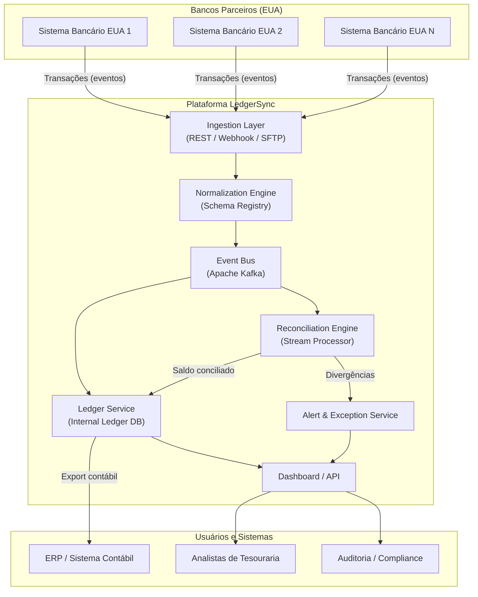
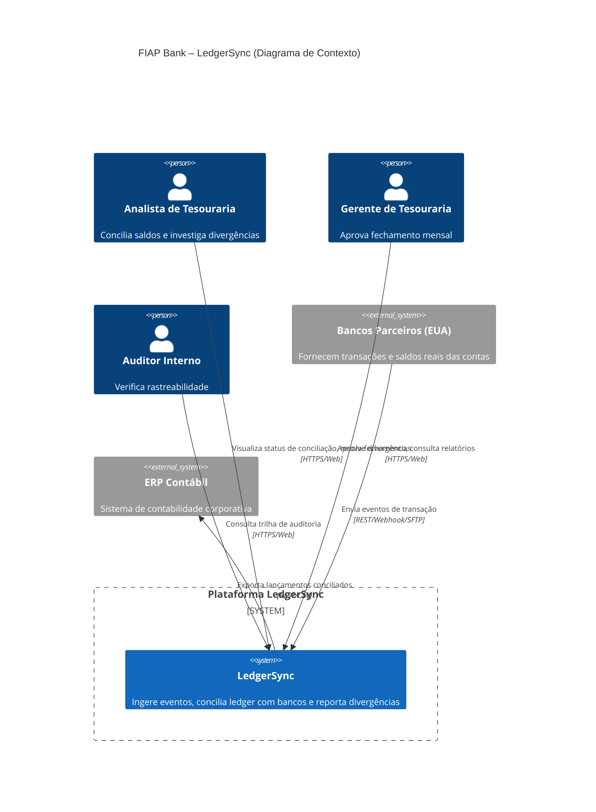
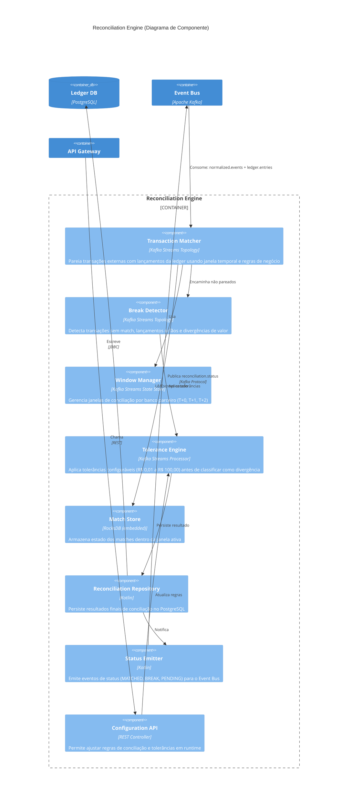

# FIAP Bank – Plataforma de Reconciliação Financeira Automatizada (LedgerSync)

> **Disciplina:** IT Architecture Design-Styles – C4 Model & Engenharia de Software  
> **Professor:** Leonardo Pinho  
> **Tema:** Fintech / Open Banking / Arquitetura Orientada a Eventos  

---

## 1. Story Telling – O Problema e o Tema

Todo mês, o departamento de tesouraria do **FIAP Bank** enfrenta um pesadelo silencioso: o fechamento de caixa. O banco movimenta milhares de transações diárias entre Brasil e Estados Unidos — investimentos, câmbio, transferências internacionais. Mas quando chega a hora de bater o saldo da **ledger financeira** (registro contábil interno) com o saldo real das contas bancárias, o processo vira um quebra-cabeça artesanal.

Planilhas são exportadas manualmente, analistas passam horas cruzando dados de sistemas diferentes, e qualquer divergência — centavos que sejam — paralisa o fechamento. O problema é a **conciliação entre o dinâmico e o estático**: a ledger opera em lotes diários, enquanto as contas bancárias oscilam em tempo real com liquidações, estornos e taxas.

O tema escolhido é **Open Banking & Arquitetura Orientada a Eventos com Data Streaming**, alinhado aos valores de Pioneirismo e Tecnologia do FIAP Bank. A proposta é construir uma plataforma — **LedgerSync** — que ingere eventos transacionais em tempo real, concilia automaticamente os saldos e notifica divergências antes que elas atrasem o fechamento.

---

## 2. O Que Esperamos Aprender com Esse Projeto?

- Como projetar uma arquitetura orientada a eventos que resolva um problema real de conciliação financeira.
- Como aplicar o modelo C4 (Contexto, Container, Componente) para comunicar decisões arquiteturais.
- Como modelar domínios complexos com eventos de negócio e streams de dados.
- Quais trade-offs existem entre consistência eventual e conciliação em tempo real.

---

## 3. Que Perguntas Precisamos Que Sejam Respondidas?

1. Como capturar eventos transacionais em tempo real de múltiplos bancos parceiros?
2. Como modelar o estado da ledger de forma que reflita o saldo real com baixa latência?
3. Qual estratégia de reconciliação usar: batch, streaming ou híbrida?
4. Como garantir idempotência no reprocessamento de eventos financeiros?
5. Como lidar com divergências não resolvidas automaticamente?

---

## 4. Quais São os Nossos Principais Riscos?

| Risco | Impacto | Probabilidade |
|---|---|---|
| Inconsistência entre ledger e saldo real por eventos duplicados | Alto | Média |
| Latência excessiva no pipeline de eventos | Alto | Média |
| Falta de padronização nos formatos de eventos dos bancos parceiros | Médio | Alta |
| Resistência do time de tesouraria à automação do processo artesanal | Médio | Alta |
| Vazamento de dados financeiros sensíveis | Crítico | Baixa |
| Sobrecarga do sistema em picos de fechamento mensal | Alto | Média |

---

## 5. Plano Para Aprender o Que Precisamos

| O que aprender | Como | Prazo |
|---|---|---|
| Padrões de arquitetura orientada a eventos (Event Sourcing, CQRS, Saga) | Estudo dirigido + PoC interna | Semana 1-2 |
| Integração com APIs de Open Banking (Bacen, parceiros EUA) | Documentação oficial + sandbox | Semana 2-3 |
| Apache Kafka ou AWS Kinesis para streaming | Hands-on lab | Semana 2-3 |
| Modelagem de domínio financeiro (double-entry ledger) | Consultoria com especialista contábil | Semana 1 |
| Estratégias de reconciliação (batch vs streaming) | Spike técnico comparativo | Semana 3 |

---

## 6. Plano Para Reduzir Riscos

| Risco | Mitigação |
|---|---|
| Eventos duplicados | Implementar idempotência via `idempotency-key` e deduplicação no broker |
| Latência no pipeline | Particionamento por conta no Kafka; consumidores em paralelo |
| Formatos heterogêneos | Camada de normalização (anti-corruption layer) com schema registry |
| Resistência do time | UX focado em simplicidade; período de operação assistida (shadow mode) |
| Vazamento de dados | Criptografia em trânsito (TLS) e em repouso (AES-256); dados anonimizados em ambientes não produtivos |
| Sobrecarga no fechamento | Auto-scaling de consumidores; processamento elástico em nuvem |

---

## 7. Quem São as Partes Interessadas (Stakeholders)?

- **Diretoria Financeira / CFO** — dona do processo de fechamento contábil.
- **Tesouraria** — usuários diretos que operam a conciliação hoje.
- **TI / Engenharia** — responsáveis por construir e manter a plataforma.
- **Compliance / Auditoria** — precisam de rastreabilidade e registros imutáveis.
- **Bancos Parceiros (EUA)** — provedores dos dados transacionais.
- **Reguladores (Bacen, SIPC)** — exigem conformidade e segurança.

---

## 8. O Que Eles Esperam Ganhar?

| Stakeholder | Expectativa |
|---|---|
| CFO | Fechamento contábil mais rápido (dias → horas), redução de erros, corte de custos operacionais |
| Tesouraria | Fim do trabalho manual de cruzamento de planilhas; alertas de divergência em tempo real |
| TI | Arquitetura moderna, escalável e de baixa manutenção operacional |
| Compliance | Trilha de auditoria imutável e conciliação rastreável |
| Bancos Parceiros | Integração padronizada, redução de chamados por divergência |

---

## 9. Quem São os Usuários?

- **Analistas de Tesouraria** — conciliam os saldos diariamente.
- **Gerentes de Tesouraria** — aprovam o fechamento mensal e investigam divergências.
- **Auditores Internos** — consultam histórico de reconciliações.
- **Sistemas Externos (máquina)** — APIs de bancos parceiros e ERP contábil.

---

## 10. O Que Eles Estão Tentando Realizar?

- **Analistas:** Conferir se o saldo da ledger bate com o saldo bancário real; identificar e classificar divergências; resolver pendências.
- **Gerentes:** Aprovar o fechamento com confiança; ter visão consolidada da saúde financeira.
- **Auditores:** Rastrear qualquer ajuste ou divergência do início ao fim.
- **Sistemas:** Enviar e receber eventos de transação de forma confiável.

---

## 11. Qual o Pior Que Pode Acontecer?

Uma divergência não detectada entre ledger e saldo real levar o banco a reportar incorretamente sua posição financeira para reguladores (Bacen/SIPC), resultando em **multas milionárias, perda de licença operacional e dano irreversível à reputação** do FIAP Bank como instituição confiável para investimentos internacionais. A confiança — um dos valores centrais da empresa — seria destruída.

---

## 12. Diagrama de Arquitetura – Modelo Freeform (Versão Inicial)



---

## 13. Descrição de Cada Componente

| Componente | Responsabilidade |
|---|---|
| **Sistemas Bancários (EUA)** | Fontes externas de verdade sobre saldos reais das contas. Enviam eventos de transação (débito, crédito, estorno, taxa) em formatos proprietários. |
| **Ingestion Layer** | Porta de entrada da plataforma. Recebe dados via REST, Webhook ou SFTP. Autentica, valida e encaminha cada evento. |
| **Normalization Engine** | Camada anti-corrupção. Converte formatos heterogêneos dos bancos para um schema canônico da plataforma. Usa Schema Registry para versionamento. |
| **Event Bus (Kafka)** | Backbone assíncrono. Garante durabilidade, ordenação por conta/partição e replay de eventos. Permite múltiplos consumidores independentes. |
| **Reconciliation Engine** | Coração da plataforma. Compara eventos do banco com eventos da ledger interna usando janelas de tempo configuráveis. Identifica matches, breaks e exceções. |
| **Ledger Service** | Mantém o livro-razão interno do FIAP Bank (double-entry). Registra cada evento contábil de forma imutável. Fonte de verdade para a posição financeira reportada. |
| **Alert & Exception Service** | Dispara notificações para divergências não resolvidas automaticamente. Cria tickets de investigação. Escala conforme criticidade. |
| **Dashboard / API** | Interface para analistas e gerentes visualizarem status de conciliação, divergências e relatórios. API para integração com ERP. |

---

## 14. Requisitos Importantes (Mínimo 5)

| # | Requisito | Por quê é importante |
|---|---|---|
| 1 | **Idempotência no processamento de eventos** | Eventos financeiros não podem ser duplicados; processar um débito duas vezes quebraria a conciliação e o saldo contábil. |
| 2 | **Rastreabilidade ponta-a-ponta (end-to-end traceability)** | Para auditoria e compliance, cada evento deve ser rastreável da origem bancária até o registro contábil final no ERP. |
| 3 | **Conciliação com janela temporal configurável** | Diferentes bancos têm diferentes SLAs de liquidação (T+0, T+1, T+2). A janela precisa ser flexível por parceiro. |
| 4 | **Segurança e criptografia de dados financeiros** | Dados de saldo e transações são sensíveis. Exigem criptografia em trânsito (TLS 1.3) e em repouso (AES-256), além de anonimização em ambientes de teste. |
| 5 | **Resiliência e tolerância a falhas** | Se um banco parceiro fica indisponível, o pipeline não pode perder eventos. Dead-letter queues e retry com backoff exponencial são obrigatórios. |
| 6 | **Interface de reconciliação manual assistida** | Nem toda divergência será resolvida automaticamente. O sistema deve sugerir matches prováveis e permitir ação humana. |

---

## 15. Sobre o Que o Diagrama Ajuda a Raciocinar/Pensar?

O diagrama Freeform força a pensar sobre:

- **Separação de responsabilidades**: cada componente tem uma função clara — ingestão, normalização, conciliação, persistência, alerta.
- **Fluxo assíncrono de dados**: o Event Bus é o ponto central de desacoplamento; nenhum componente conversa diretamente com outro.
- **Fontes de verdade múltiplas**: a ledger interna e os sistemas bancários externos são duas fontes de verdade que precisam ser comparadas — não há uma verdade absoluta única.
- **Tratamento de exceções como cidadão de primeira classe**: divergências não são erros de sistema, são eventos de negócio que precisam de workflow próprio.

---

## 16. Quais São os Padrões Essenciais no Diagrama?

| Padrão | Onde aparece |
|---|---|
| **Event-Driven Architecture (EDA)** | O Event Bus (Kafka) é o backbone; toda comunicação entre componentes é assíncrona via eventos. |
| **Pipes and Filters** | O fluxo Ingestion → Normalization → Event Bus → Reconciliation → Ledger é uma cadeia de filtros/transformações. |
| **Anti-Corruption Layer (ACL)** | O Normalization Engine traduz formatos externos para o domínio interno, impedindo que modelos de terceiros "contaminem" o sistema. |
| **CQRS (segregado implícito)** | O Reconciliation Engine escreve conciliações; o Dashboard lê do Ledger Service. Caminhos de leitura e escrita são distintos. |
| **Event Sourcing** | A Ledger armazena eventos imutáveis, permitindo reconstruir o estado do saldo a qualquer ponto no tempo. |

---

## 17. Existem Padrões Ocultos?

Sim. Alguns padrões emergem quando se aprofunda a análise:

- **Outbox Pattern**: implícito na necessidade de garantir que a escrita na ledger e a publicação do evento de conciliação ocorram atomicamente. Se o Ledger Service escreve no banco mas o evento não chega ao Event Bus, o sistema fica inconsistente.
- **Saga (coreografada)**: o fluxo de reconciliação pode ser visto como uma saga de múltiplos passos (receber evento → normalizar → comparar → decidir match/break → persistir → notificar). Se um passo falha, é preciso compensar.
- **Strangler Fig**: a plataforma nova precisa conviver com o processo artesanal antigo durante a transição (shadow mode), gradualmente substituindo-o.

---

## 18. Qual é o Metamodelo?

O metamodelo define os conceitos fundamentais do domínio e seus relacionamentos:

```
Cliente (1) ─── (N) Conta ─── (1) Banco Parceiro
                           │
                           └── (N) Transação (externa)
                                            │
Ledger (1) ─── (N) Lançamento Contábil ────┘ (match 0..1)
                                            │
Reconciliação (N) ─── (2) [Transação + Lançamento]
                                            │
Divergência (0..N) ─── (1) Reconciliação
```

**Entidades principais:**
- **Conta**: Uma conta bancária real em um banco parceiro.
- **Transação (externa)**: Evento vindo do banco parceiro (débito, crédito, taxa, estorno).
- **Lançamento Contábil**: Registro na ledger interna (double-entry).
- **Reconciliação**: O pareamento entre uma Transação e um Lançamento Contábil (ou múltiplos).
- **Divergência**: Quando não há pareamento possível (missing entry, missing transaction, amount mismatch).

---

## 19. Pode Ser Discernido no Diagrama Único?

Parcialmente. O diagrama Freeform mostra a **estrutura de componentes e fluxo de dados**, mas o metamodelo (entidades e relacionamentos) não está explícito nele. Um diagrama de classes ou entidade-relacionamento complementar seria necessário para expressar completamente o metamodelo. O C4 Model resolve isso ao separar os níveis de abstração: o Contexto mostra atores e sistemas; o Container mostra a estrutura técnica; o Componente mostra o metamodelo em ação dentro de cada container.

---

## 20. O Diagrama Está Completo?

Não completamente. O diagrama Freeform cobre o fluxo principal (happy path), mas omite:

- **Mecanismos de resiliência**: dead-letter queues, retry policies, circuit breakers.
- **Infraestrutura transversal**: observabilidade (logs, métricas, tracing), autenticação/autorização.
- **Processos batch complementares**: fechamento mensal ainda pode exigir um job batch de consolidação.
- **Shadow mode**: período de validação onde o novo sistema roda em paralelo ao antigo.

---

## 21. Poderia Ser Simplificado e Ainda Ser Eficaz?

Sim. Para um público executivo (CFO, Diretoria), bastaria mostrar:

- **Bancos Parceiros → LedgerSync → Tesouraria/ERP** (visão de contexto, nível 1 do C4).
- O detalhamento interno (Kafka, Normalization, Reconciliation Engine) é relevante apenas para o público técnico.

A beleza do C4 Model é exatamente essa: cada nível de zoom é adequado a um público diferente.

---

## 22. Houve Alguma Discussão Importante Que Tivemos Como Equipe?

Sim, três discussões foram cruciais:

1. **Batch vs Streaming para reconciliação**: debatemos se a conciliação deveria ser um job batch noturno (mais simples) ou um pipeline de streaming contínuo (mais complexo, porém mais rápido). Optamos pelo híbrido: streaming para alertas em tempo real, batch para o fechamento oficial mensal.

2. **Modelo de consistência da ledger**: Event Sourcing com consistência eventual vs transações ACID tradicionais. Decidimos por Event Sourcing com projeções materializadas para consultas, pois o histórico imutável de eventos é requisito de auditoria.

3. **Quem é o dono da reconciliação?**: A reconciliação pertence ao domínio de "Conciliação" (um bounded context próprio) ou ao domínio de "Ledger"? Optamos por separá-los: a Ledger é fonte de verdade; a Reconciliação é o processo que compara fontes.

---

## 23. Que Decisões Sua Equipe Teve Dificuldade Para Tomar?

1. **Escolha do broker de mensageria**: Kafka (mais infraestrutura) vs Amazon SQS/SNS (mais gerenciado). Kafka venceu pela capacidade de replay de eventos e ordenação por partição — crítico para eventos financeiros.

2. **Armazenamento da ledger**: Banco relacional (PostgreSQL) vs banco de eventos especializado (EventStoreDB). Optamos por PostgreSQL com tabela de eventos + projeções, por familiaridade da equipe e ecossistema de ferramentas.

3. **Linguagem do Reconciliation Engine**: Python (rápido desenvolvimento, time de dados) vs Java/Kotlin (performance, ecossistema Kafka). Decidimos por Kotlin com Kafka Streams para maior robustez em produção.

---

## 24. Que Decisões Foram Tomadas Sob Incerteza?

1. **Volume real de transações do FIAP Bank**: sem dados históricos precisos, superdimensionamos o particionamento do Kafka (100 partições) e projetamos auto-scaling desde o início.

2. **Adoção de blockchain**: foi sugerida nas informações do case, mas decidimos prototipar sem blockchain inicialmente. A rastreabilidade já é obtida via Event Sourcing. Se no futuro houver necessidade de compartilhar trilhas de auditoria com reguladores externos de forma descentralizada, um ledger distribuído (DLT) pode ser adicionado como camada complementar.

3. **Integração com bancos parceiros**: não sabemos quantos bancos teremos nem seus protocolos. A Anti-Corruption Layer foi projetada para ser extensível (adapter por banco), mas o esforço real de integração é uma incerteza.

---

## 25. Houve Algum Ponto de Decisão Sem Retorno?

Sim. A decisão de usar **Event Sourcing como padrão de persistência da ledger** é um ponto de não retorno arquitetural. Uma vez que os eventos são a fonte primária de verdade:

- Migrar para um modelo CRUD tradicional exigiria reescrever toda a camada de domínio.
- Todas as consultas, relatórios e integrações passam a depender das projeções.
- O custo de reverter essa decisão após o go-live é proibitivo.

Por outro lado, ela desbloqueia: replay completo do histórico, auditoria imutável, e capacidade de responder novas perguntas de negócio simplesmente criando novas projeções sobre o mesmo stream de eventos.

---

## 26 a 29. Arquitetura C4 Model – 3 Camadas

### 26-27. Nível 1: Diagrama de Contexto



### 28. Nível 2: Diagrama de Container

```mermaid
C4Container
    title FIAP Bank – LedgerSync (Diagrama de Container)

    Person(analista, "Analista de Tesouraria")
    Person(gerente, "Gerente de Tesouraria")
    Person(auditor, "Auditor Interno")

    System_Ext(banco_parceiro, "Bancos Parceiros (EUA)")
    System_Ext(erp, "ERP Contábil")

    System_Boundary(ledgersync, "Plataforma LedgerSync") {
        Container(webapp, "SPA Dashboard", "React + TypeScript", "Interface para analistas, gerentes e auditores")
        Container(api, "API Gateway", "Kotlin + Spring Boot", "Autenticação, rate limiting, roteamento")
        Container(ingestion, "Ingestion Service", "Go", "Recebe eventos dos bancos parceiros (REST/Webhook/SFTP)")
        Container(normalizer, "Normalization Service", "Kotlin", "Converte formatos proprietários para schema canônico")
        Container(kafka, "Event Bus", "Apache Kafka", "Backbone assíncrono de eventos com particionamento por conta")
        Container(recon_engine, "Reconciliation Engine", "Kotlin + Kafka Streams", "Compara eventos externos com ledger interna e detecta divergências")
        Container(ledger_svc, "Ledger Service", "Kotlin + Spring Boot", "Mantém o livro-razão interno (Event Sourcing)")
        Container(alert_svc, "Alert & Exception Service", "Kotlin", "Notifica divergências e gerencia workflow de investigação")
        ContainerDb(ledger_db, "Ledger DB", "PostgreSQL", "Event store + projeções materializadas")
        ContainerDb(cache, "Cache", "Redis", "Saldos recentes, sessões, rate limiting")
        Container(schema_reg, "Schema Registry", "Confluent", "Versionamento de schemas de eventos")
    }

    Rel(analista, webapp, "Usa", "HTTPS")
    Rel(gerente, webapp, "Usa", "HTTPS")
    Rel(auditor, webapp, "Usa", "HTTPS")
    Rel(webapp, api, "Chama API", "REST/HTTPS")
    
    Rel(banco_parceiro, ingestion, "Envia transações", "REST/Webhook/SFTP")
    Rel(ingestion, kafka, "Publica raw events", "Kafka Protocol")
    Rel(kafka, normalizer, "Consome raw events", "Kafka Protocol")
    Rel(normalizer, kafka, "Publica normalized events", "Kafka Protocol")
    Rel(normalizer, schema_reg, "Registra/valida schema", "REST")
    
    Rel(kafka, recon_engine, "Consome eventos normalizados", "Kafka Streams")
    Rel(kafka, ledger_svc, "Consome eventos normalizados", "Kafka Protocol")
    Rel(ledger_svc, ledger_db, "Lê/Escreve eventos e projeções", "JDBC")
    Rel(recon_engine, ledger_db, "Consulta projeções da ledger", "JDBC")
    Rel(recon_engine, kafka, "Publica Match/Break events", "Kafka Protocol")
    Rel(kafka, alert_svc, "Consome Break events", "Kafka Protocol")
    Rel(alert_svc, kafka, "Publica alertas processados", "Kafka Protocol")
    
    Rel(api, kafka, "Consome eventos de status", "Kafka Protocol")
    Rel(ledger_svc, erp, "Exporta lançamentos conciliados", "REST")
```



### 29. Nível 3: Diagrama de Componente – Reconciliation Engine



### 30. Nível 4: Code (Opcional)

Organização de pacotes do **Ledger Service** (Kotlin + Spring Boot):

```
com.fiapbank.ledgersync
├── ledger
│   ├── domain
│   │   ├── LedgerEntry.kt          // Entidade: lançamento contábil
│   │   ├── AccountId.kt            // Value Object: identificador de conta
│   │   ├── Money.kt                // Value Object: valor monetário + moeda
│   │   ├── EntryType.kt            // Enum: DEBIT / CREDIT
│   │   └── LedgerAggregate.kt      // Aggregate Root: livro-razão por conta
│   ├── events
│   │   ├── EntryRecorded.kt        // Evento de domínio
│   │   ├── ReconciliationMatched.kt
│   │   └── ReconciliationBroke.kt
│   ├── infrastructure
│   │   ├── EventStore.kt           // Persistência de eventos
│   │   ├── Projection.kt           // Projeção materializada
│   │   └── KafkaPublisher.kt       // Outbox para Event Bus
│   └── application
│       ├── RecordEntryUseCase.kt
│       ├── GetBalanceQuery.kt
│       └── GetAuditTrailQuery.kt
```

---

## 31. Validação no Checklist (C4 Model Review)

Validamos os diagramas contra os critérios do [c4model.com/review](https://c4model.com/review/) (opcional):

| Critério | Contexto | Container | Componente |
|---|---|---|---|
| Título e legenda presentes | ✔ | ✔ | ✔ |
| Cada elemento tem nome + tipo | ✔ | ✔ | ✔ |
| Setas têm direção + descrição | ✔ | ✔ | ✔ |
| Diagrama tem foco claro (um nível de abstração) | ✔ | ✔ | ✔ |
| Tecnologias explícitas (rótulos) | ✔ | ✔ | ✔ |
| Não mistura níveis de abstração | ✔ | ✔ | ✔ |
| Público-alvo identificável | ✔ | ✔ | ✔ |

---

## 32. Vídeo de Apresentação

Conforme solicitado, gravar um vídeo explicando o projeto como um todo, passando por:
- O problema de negócio (conciliação de ledger do FIAP Bank)
- A solução proposta (LedgerSync)
- Os diagramas C4 (Contexto → Container → Componente)
- Decisões arquiteturais e trade-offs

**Todos os integrantes devem apresentar uma parte.** O vídeo deverá ser compartilhado com o professor via e-mail: `profleonardo.pinho@fiap.com.br` / `leonardo.c.pinho@gmail.com`.

---

## Resumo da Stack Tecnológica

| Camada | Tecnologia |
|---|---|
| Frontend | React + TypeScript, TailwindCSS |
| API Gateway | Kotlin + Spring Boot + Spring Cloud Gateway |
| Ingestion | Go (alta concorrência, baixa latência) |
| Normalization | Kotlin |
| Event Bus | Apache Kafka + Confluent Schema Registry |
| Reconciliation Engine | Kotlin + Kafka Streams |
| Ledger Service | Kotlin + Spring Boot + PostgreSQL (Event Store) |
| Cache | Redis |
| Alert Service | Kotlin |
| Observabilidade | OpenTelemetry, Prometheus, Grafana |
| Infra | Kubernetes (AWS EKS), Terraform |

---

## Referências

- [C4 Model – Documentação Oficial](https://c4model.com/)
- [C4 Model Review Checklist](https://c4model.com/review/)
- [Kafka Streams Documentation](https://kafka.apache.org/documentation/streams/)
- [Event Sourcing Pattern – Martin Fowler](https://martinfowler.com/eaaDev/EventSourcing.html)
- [Domain-Driven Design – Eric Evans](https://www.domainlanguage.com/ddd/)
