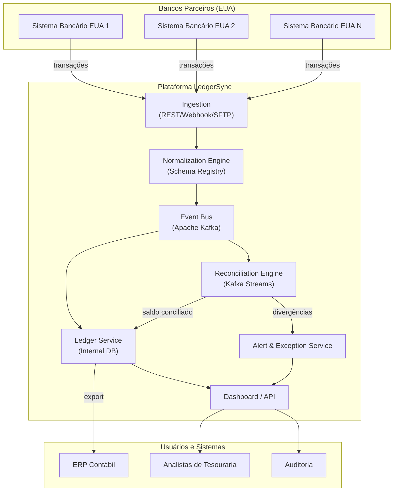
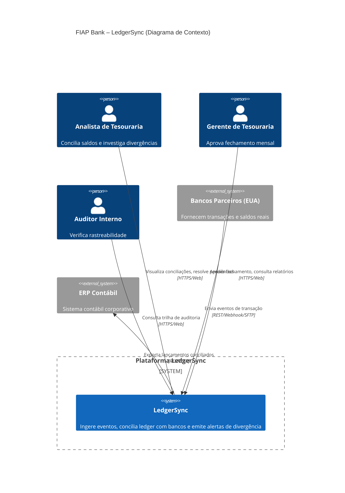
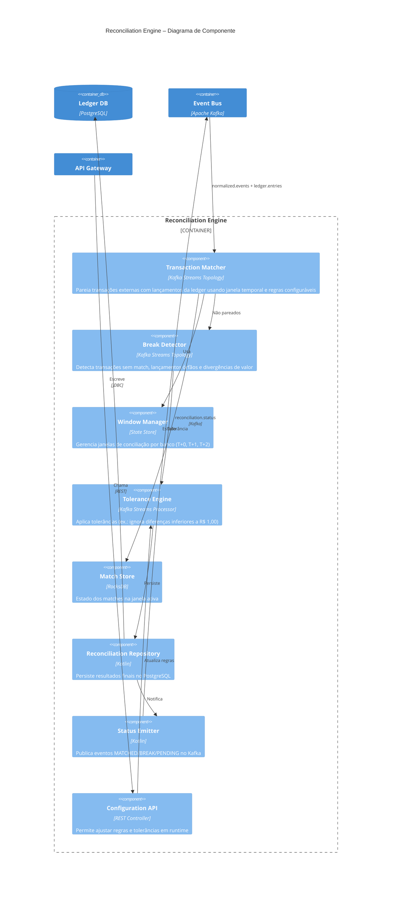

# FIAP Bank – LedgerSync: Plataforma de Reconciliação Financeira

> **Disciplina:** IT Architecture Design-Styles – C4 Model & Engenharia de Software  
> **Professor:** Leonardo Pinho  
> **Tema:** Fintech / Open Banking / Arquitetura Orientada a Eventos  

## 1. Story Telling – O Problema e o Tema

Todo mês, o departamento de tesouraria do **FIAP Bank** enfrenta um obstáculo recorrente: o fechamento do caixa. O banco opera com investimentos internacionais e movimenta milhares de transações entre Brasil e Estados Unidos — câmbio, transferências, taxas e estornos. Contudo, quando chega o momento de conciliar o saldo da **ledger** (livro-razão interno) com o saldo real das contas mantidas nos bancos parceiros americanos, o processo se revela frágil e excessivamente manual.

Atualmente, os analistas exportam planilhas de sistemas distintos e passam horas cruzando dados. Qualquer divergência, por menor que seja, paralisa o fechamento contábil. A raiz do problema está na natureza assimétrica das fontes: a ledger opera em lotes diários, enquanto as contas bancárias oscilam em tempo real com liquidações, estornos e tarifas. Conciliar o estático com o dinâmico sem uma camada de automação robusta é ineficiente e arriscado.

O tema escolhido para este trabalho é **Open Banking & Arquitetura Orientada a Eventos com Data Streaming**, alinhado aos valores de Pioneirismo e Tecnologia do FIAP Bank. A solução proposta — **LedgerSync** — consiste em uma plataforma que captura eventos transacionais em tempo real oriundos dos bancos parceiros, concilia automaticamente com a ledger interna e notifica imediatamente qualquer divergência, eliminando a dependência do fechamento mensal para identificar problemas.

## 2. O Que Esperamos Aprender com Este Projeto

O trabalho nos permite explorar, na prática e em profundidade, os seguintes tópicos:

- Projetar uma arquitetura orientada a eventos capaz de resolver um problema real de conciliação financeira.
- Aplicar o modelo C4 (Contexto, Contêiner, Componente) como ferramenta de comunicação de decisões arquiteturais.
- Modelar um domínio financeiro complexo utilizando eventos de negócio e streams de dados.
- Compreender os trade-offs entre consistência eventual e processamento em tempo real no contexto financeiro.

## 3. Perguntas Que Precisam Ser Respondidas

1. Como capturar eventos transacionais em tempo real de múltiplos bancos parceiros, cada qual com seu formato proprietário?
2. Como modelar o estado da ledger para que reflita o saldo real com a menor latência possível?
3. Qual estratégia de reconciliação adotar: processamento em lote, em streaming ou uma abordagem híbrida?
4. Como assegurar idempotência no reprocessamento de eventos financeiros, evitando duplicidades que comprometam os saldos?
5. Como tratar as divergências que o sistema não consegue resolver de forma automatizada?

## 4. Principais Riscos

| Risco | Impacto | Probabilidade |
|---|---|---|
| Inconsistência entre ledger e saldo real por eventos duplicados | Alto | Média |
| Latência excessiva no pipeline de eventos, atrasando alertas | Alto | Média |
| Heterogeneidade nos formatos de eventos enviados pelos bancos parceiros | Médio | Alta |
| Resistência da equipe de tesouraria em abandonar o processo manual | Médio | Alta |
| Vazamento de dados financeiros sensíveis | Crítico | Baixa |
| Sobrecarga da plataforma nos picos de fechamento mensal | Alto | Média |

## 5. Plano Para Aprender o Necessário

| O que aprender | Como | Prazo |
|---|---|---|
| Padrões de arquitetura orientada a eventos (Event Sourcing, CQRS, Saga) | Estudo dirigido e prova de conceito | Semana 1-2 |
| Integração com APIs de Open Banking (Bacen, parceiros EUA) | Documentação oficial e ambiente sandbox | Semana 2-3 |
| Apache Kafka e Kafka Streams para processamento de streams | Laboratório prático | Semana 2-3 |
| Modelagem de domínio contábil (partidas dobradas) | Consultoria com especialista contábil | Semana 1 |
| Comparação entre reconciliação batch e streaming | Spike técnico comparativo | Semana 3 |

## 6. Plano Para Reduzir os Riscos

| Risco | Mitigação |
|---|---|
| Eventos duplicados | Idempotência via `idempotency-key` e deduplicação no broker de mensageria |
| Latência no pipeline | Particionamento por conta no Kafka e consumidores paralelos escaláveis |
| Formatos heterogêneos | Camada de normalização (Anti-Corruption Layer) com Schema Registry centralizado |
| Resistência da tesouraria | Interface simplificada e período de operação assistida (shadow mode) |
| Vazamento de dados | Criptografia TLS 1.3 em trânsito e AES-256 em repouso; anonimização em ambientes de desenvolvimento |
| Pico de carga no fechamento | Auto-scaling dos consumidores no Kubernetes; dimensionamento elástico |

## 7. Partes Interessadas (Stakeholders)

- **Diretoria Financeira / CFO** — responsável pelo processo de fechamento contábil.
- **Tesouraria** — equipe que executa a conciliação manual atualmente e será a principal usuária da plataforma.
- **TI / Engenharia** — responsável pela construção, manutenção e evolução da plataforma.
- **Compliance / Auditoria** — necessita de rastreabilidade completa e registros imutáveis.
- **Bancos Parceiros (EUA)** — provedores dos dados transacionais que alimentam a plataforma.
- **Reguladores (Bacen, SIPC)** — exigem conformidade regulatória e segurança da informação.

## 8. O Que Cada Stakeholder Espera Obter

| Stakeholder | Expectativa |
|---|---|
| CFO | Fechamento contábil em horas, redução de erros operacionais e corte de custos |
| Tesouraria | Fim do cruzamento manual de planilhas; detecção de divergências em tempo real |
| TI | Arquitetura moderna, escalável e com baixa sobrecarga operacional |
| Compliance | Trilha de auditoria imutável e rastreabilidade de ponta a ponta |
| Bancos Parceiros | Integração padronizada, com menos chamados por divergência |

## 9. Quem São os Usuários

- **Analistas de Tesouraria** — executam a conciliação diária dos saldos.
- **Gerentes de Tesouraria** — aprovam o fechamento mensal e investigam divergências críticas.
- **Auditores Internos** — consultam o histórico de reconciliações para fins de auditoria.
- **Sistemas Externos** — APIs dos bancos parceiros e o ERP contábil da instituição.

## 10. O Que Cada Usuário Deseja Realizar

- **Analistas:** Verificar se o saldo da ledger coincide com o saldo bancário; classificar divergências; resolver pendências.
- **Gerentes:** Aprovar o fechamento com segurança; obter visão consolidada da posição financeira.
- **Auditores:** Rastrear cada lançamento desde a origem bancária até o registro contábil final.
- **Sistemas Externos:** Enviar e receber eventos transacionais de forma confiável e auditável.

## 11. Pior Cenário Possível

Uma divergência não detectada entre a ledger e o saldo real levar o FIAP Bank a reportar incorretamente sua posição financeira aos reguladores (Bacen e SIPC). As consequências incluiriam multas de valor elevado, risco de perda da licença operacional e dano irreparável à reputação da instituição. Considerando que a confiança é um dos valores fundamentais do banco, as repercussões seriam catastróficas.

## 12. Diagrama de Arquitetura — Modelo Freeform (Versão Inicial)

O diagrama abaixo representa o primeiro esboço da arquitetura, elaborado durante as discussões iniciais da equipe:



## 13. Descrição de Cada Componente

| Componente | Responsabilidade |
|---|---|
| **Sistemas Bancários (EUA)** | Fontes externas de verdade que detêm os saldos reais das contas. Enviam eventos transacionais (débito, crédito, estorno, taxa) em formatos proprietários. |
| **Ingestion** | Porta de entrada da plataforma. Recebe dados via REST, Webhook ou SFTP. Realiza a autenticação, validação e encaminhamento de cada evento. |
| **Normalization Engine** | Camada anti-corrupção que converte os formatos heterogêneos dos bancos parceiros para um schema canônico interno. Utiliza Schema Registry para versionamento. |
| **Event Bus (Apache Kafka)** | Espinha dorsal assíncrona da plataforma. Oferece durabilidade, ordenação por conta/partição e capacidade de replay de eventos. Permite múltiplos consumidores independentes. |
| **Reconciliation Engine** | Núcleo da plataforma. Consome eventos externos e eventos da ledger, comparando-os dentro de janelas temporais configuráveis. Identifica matches, breaks e exceções. |
| **Ledger Service** | Mantém o livro-razão interno do FIAP Bank no modelo de partidas dobradas. Cada lançamento é registrado de forma imutável, servindo como fonte de verdade para a posição financeira. |
| **Alert & Exception Service** | Notifica a equipe de tesouraria sobre divergências não resolvidas automaticamente. Cria tickets de investigação e escala conforme a criticidade. |
| **Dashboard / API** | Interface para analistas e gerentes visualizarem o status da conciliação, relatórios e divergências. Disponibiliza API para integração com o ERP contábil. |

## 14. Requisitos Considerados Importantes (Mínimo 5)

| # | Requisito | Justificativa |
|---|---|---|
| 1 | **Idempotência no processamento de eventos** | Eventos financeiros não podem ser processados mais de uma vez. Um débito duplicado comprometeria tanto a conciliação quanto o saldo contábil. |
| 2 | **Rastreabilidade ponta a ponta** | Auditoria e compliance exigem que cada evento seja rastreável desde o banco parceiro até o registro final no ERP, sem lacunas. |
| 3 | **Janela de conciliação configurável por banco** | Diferentes bancos operam com prazos de liquidação distintos (T+0, T+1, T+2). A janela precisa ser flexível para cada parceiro. |
| 4 | **Segurança e criptografia dos dados** | Dados de saldo e transações são sensíveis. Exigem TLS 1.3 em trânsito, AES-256 em repouso e anonimização em ambientes não produtivos. |
| 5 | **Resiliência e tolerância a falhas** | A indisponibilidade de um banco parceiro não pode causar perda de eventos. São necessários mecanismos de dead-letter queue e retry com backoff exponencial. |
| 6 | **Interface para reconciliação manual assistida** | Nem toda divergência será resolvida automaticamente. O sistema deve sugerir correspondências prováveis e permitir a decisão do analista. |

## 15. Sobre o Que o Diagrama Ajuda a Raciocinar

O diagrama Freeform orienta a reflexão sobre quatro pontos centrais:

- **Separação de responsabilidades:** cada componente possui uma função bem definida — ingestão, normalização, conciliação, persistência e notificação. Isso facilita o debate sobre cada etapa do fluxo.
- **Desacoplamento via Event Bus:** o Kafka atua como ponto central de integração. Nenhum componente se comunica diretamente com outro, o que permite evolução independente de cada módulo.
- **Duas fontes de verdade:** a ledger interna e os sistemas bancários externos são duas realidades que precisam ser confrontadas. O sistema não presume uma verdade absoluta única.
- **Divergência como evento de negócio:** divergências não são tratadas como erros de sistema, mas como ocorrências esperadas que exigem um workflow próprio de tratamento.

## 16. Padrões Essenciais no Diagrama

| Padrão | Ocorrência |
|---|---|
| **Event-Driven Architecture (EDA)** | O Event Bus (Kafka) é o backbone da plataforma; toda comunicação entre componentes é assíncrona e baseada em eventos. |
| **Pipes and Filters** | O fluxo Ingestion → Normalization → Kafka → Reconciliation → Ledger constitui uma cadeia de transformações sucessivas. |
| **Anti-Corruption Layer (ACL)** | O Normalization Engine traduz formatos externos para o domínio interno, impedindo que modelos de terceiros contaminem o sistema. |
| **CQRS (implícito)** | O Reconciliation Engine escreve os resultados; o Dashboard lê do Ledger Service. Os caminhos de escrita e leitura são segregados. |
| **Event Sourcing** | A ledger armazena eventos imutáveis em vez de um estado de saldo corrente, permitindo reconstruir a posição financeira em qualquer instante. |

## 17. Padrões Ocultos

Uma análise mais aprofundada revela padrões que não estão explicitamente representados no diagrama, mas que são necessários para o funcionamento correto da plataforma:

- **Outbox Pattern:** o Ledger Service precisa assegurar atomicidade entre a escrita no banco de dados e a publicação do evento no Kafka. Se uma das operações falhar sem a outra, o sistema torna-se inconsistente.
- **Saga (coreografada):** o fluxo de reconciliação pode ser interpretado como uma saga de múltiplos passos (receber evento, normalizar, comparar, decidir match/break, persistir, notificar). A falha em qualquer etapa exige compensação.
- **Strangler Fig:** a nova plataforma não substituirá o processo manual abruptamente. Haverá um período de shadow mode, durante o qual o sistema novo opera em paralelo ao legado, permitindo validação gradual.

## 18. Metamodelo

O metamodelo define os conceitos fundamentais do domínio e seus relacionamentos:

```
Cliente (1) ─── (N) Conta ─── (1) Banco Parceiro
                           │
                           └── (N) Transação (externa)
                                            │
Ledger (1) ─── (N) Lançamento Contábil ────┘ (match 0..1)
                                            │
Reconciliação (N) ─── (2) [Transação + Lançamento]
                                            │
Divergência (0..N) ─── (1) Reconciliação
```

**Entidades principais:**

- **Conta:** conta bancária real mantida em um banco parceiro.
- **Transação (externa):** evento proveniente do banco parceiro (débito, crédito, taxa, estorno).
- **Lançamento Contábil:** registro na ledger interna, obedecendo ao modelo de partidas dobradas.
- **Reconciliação:** pareamento entre uma ou mais transações externas e seus correspondentes lançamentos contábeis.
- **Divergência:** situação em que não é possível estabelecer um pareamento (lançamento órfão, transação sem correspondência, diferença de valor).

## 19. O Metamodelo Pode Ser Discernido no Diagrama Único?

Apenas parcialmente. O diagrama Freeform representa a estrutura de componentes e o fluxo de dados, mas o metamodelo — entidades, relacionamentos e cardinalidades — não está explícito. Seria necessário um diagrama de classes ou entidade-relacionamento complementar. O C4 Model endereça essa limitação ao separar os níveis de abstração: o Contexto mostra atores e sistemas; o Contêiner revela a estrutura técnica; o Componente expõe como as entidades do metamodelo circulam dentro de cada serviço.

## 20. O Diagrama Está Completo?

Não. O diagrama Freeform cobre o fluxo principal, mas omite diversos aspectos relevantes:

- Mecanismos de resiliência: dead-letter queues, políticas de retry, circuit breakers.
- Infraestrutura transversal: observabilidade (logs, métricas, tracing distribuído), autenticação e autorização.
- Processos batch complementares: o fechamento mensal ainda pode exigir um job de consolidação.
- Período de shadow mode: fase de validação em que o sistema opera em paralelo ao legado.

## 21. O Diagrama Poderia Ser Simplificado Mantendo Sua Eficácia?

Sim. Para um público executivo (CFO, Diretoria), uma representação reduzida seria suficiente:

> **Bancos Parceiros → LedgerSync → Tesouraria / ERP**

Esse é justamente o nível de Contexto do C4 Model. O detalhamento interno (Kafka, Schema Registry, Reconciliation Engine) só é relevante para o público técnico. A virtude do C4 Model está exatamente nisto: cada nível de zoom é adequado a um público distinto.

## 22. Discussões Relevantes da Equipe

Três debates foram particularmente produtivos durante a elaboração do projeto:

1. **Batch versus streaming para a reconciliação:** discutimos se o motor de conciliação deveria operar como um job noturno (mais simples e previsível) ou como um pipeline de streaming contínuo (mais rápido, porém mais complexo). Optamos por uma abordagem híbrida: streaming para alertas em tempo real e batch para o fechamento oficial mensal.

2. **Modelo de persistência da ledger:** Event Sourcing com consistência eventual versus CRUD tradicional com transações ACID. Escolhemos Event Sourcing porque o histórico imutável atende diretamente aos requisitos de auditoria. Adicionamos projeções materializadas para evitar a recomputação completa em cada consulta.

3. **Responsabilidade pelo domínio da reconciliação:** a reconciliação pertence ao bounded context da Ledger ou constitui um domínio separado? Decidimos segregá-los: a Ledger é a fonte de verdade; a Reconciliation é o processo que compara fontes distintas.

## 23. Decisões Que a Equipe Teve Dificuldade Para Tomar

1. **Escolha do broker de mensageria:** Apache Kafka (maior carga operacional) ou uma solução gerenciada como Amazon SQS/SNS (menor complexidade de infraestrutura). Kafka prevaleceu devido à capacidade de replay de eventos e à ordenação por partição — características críticas para eventos financeiros.

2. **Armazenamento da ledger:** PostgreSQL com tabela de eventos versus EventStoreDB (banco especializado em Event Sourcing). O PostgreSQL foi escolhido por familiaridade da equipe e pela maturidade do ecossistema de ferramentas disponíveis.

3. **Linguagem do Reconciliation Engine:** Python (prototipagem rápida, adequação ao perfil de equipes de dados) versus Kotlin (performance superior e integração nativa com Kafka Streams). Kotlin foi selecionado por oferecer maior robustez em ambientes de produção.

## 24. Decisões Tomadas Sob Incerteza

1. **Volume real de transações do FIAP Bank:** sem dados históricos precisos, superdimensionamos o particionamento do Kafka (100 partições) e projetamos auto-scaling desde a concepção inicial.

2. **Adoção de blockchain:** embora mencionada nas informações do case, optamos por prototipar sem blockchain. O Event Sourcing já provê rastreabilidade imutável. Caso surja futuramente a necessidade de compartilhar trilhas de auditoria com entidades externas de forma descentralizada, um ledger distribuído (DLT) poderá ser acoplado como camada complementar.

3. **Integração com bancos parceiros:** desconhecemos o número exato de bancos e seus protocolos. A camada de Anti-Corruption foi projetada como extensível (adapter por banco), mas o esforço real de integração permanece como incógnita.

## 25. Ponto de Decisão Sem Retorno

A adoção de **Event Sourcing como padrão de persistência da ledger** constitui um ponto de não retorno arquitetural. Uma vez que os eventos se tornam a fonte primária de verdade:

- Migrar para um modelo CRUD convencional exigiria reescrever integralmente a camada de domínio.
- Todas as consultas, relatórios e integrações passam a depender das projeções materializadas.
- O custo de reverter essa decisão após a entrada em produção seria proibitivo.

Em contrapartida, essa decisão desbloqueia capacidades valiosas: replay completo do histórico transacional, trilha de auditoria imutável e flexibilidade para responder a novas perguntas de negócio simplesmente criando novas projeções sobre o mesmo stream de eventos.

## 26 a 29. Arquitetura C4 Model — Três Camadas

### 26-27. Nível 1: Diagrama de Contexto



### 28. Nível 2: Diagrama de Contêiner

```mermaid
C4Container
    title FIAP Bank – LedgerSync (Diagrama de Contêiner)

    Person(analista, "Analista de Tesouraria")
    Person(gerente, "Gerente de Tesouraria")
    Person(auditor, "Auditor Interno")

    System_Ext(banco_parceiro, "Bancos Parceiros (EUA)")
    System_Ext(erp, "ERP Contábil")

    System_Boundary(ledgersync, "Plataforma LedgerSync") {
        Container(webapp, "Dashboard SPA", "React + TypeScript", "Interface para analistas, gerentes e auditores")
        Container(api, "API Gateway", "Kotlin + Spring Boot", "Autenticação, rate limiting e roteamento")
        Container(ingestion, "Ingestion Service", "Go", "Recebe eventos dos bancos parceiros (REST/Webhook/SFTP)")
        Container(normalizer, "Normalization Service", "Kotlin", "Converte formatos proprietários para o schema canônico")
        Container(kafka, "Event Bus", "Apache Kafka", "Backbone assíncrono com particionamento por conta")
        Container(recon_engine, "Reconciliation Engine", "Kotlin + Kafka Streams", "Compara eventos externos com a ledger, detecta divergências")
        Container(ledger_svc, "Ledger Service", "Kotlin + Spring Boot", "Mantém o livro-razão interno (Event Sourcing)")
        Container(alert_svc, "Alert & Exception Service", "Kotlin", "Notifica divergências e gerencia workflow de investigação")
        ContainerDb(ledger_db, "Ledger DB", "PostgreSQL", "Event store e projeções materializadas")
        ContainerDb(cache, "Cache", "Redis", "Saldos recentes, sessões e rate limiting")
        Container(schema_reg, "Schema Registry", "Confluent", "Versionamento de schemas de eventos")
    }

    Rel(analista, webapp, "Usa", "HTTPS")
    Rel(gerente, webapp, "Usa", "HTTPS")
    Rel(auditor, webapp, "Usa", "HTTPS")
    Rel(webapp, api, "Chama API", "REST/HTTPS")
    
    Rel(banco_parceiro, ingestion, "Envia transações", "REST/Webhook/SFTP")
    Rel(ingestion, kafka, "Publica evento bruto", "Kafka")
    Rel(kafka, normalizer, "Consome evento bruto", "Kafka")
    Rel(normalizer, kafka, "Publica evento normalizado", "Kafka")
    Rel(normalizer, schema_reg, "Valida schema", "REST")
    
    Rel(kafka, recon_engine, "Consome eventos normalizados", "Kafka Streams")
    Rel(kafka, ledger_svc, "Consome eventos normalizados", "Kafka")
    Rel(ledger_svc, ledger_db, "Lê e escreve eventos", "JDBC")
    Rel(recon_engine, ledger_db, "Consulta projeções da ledger", "JDBC")
    Rel(recon_engine, kafka, "Publica Match/Break", "Kafka")
    Rel(kafka, alert_svc, "Consome Break", "Kafka")
    Rel(alert_svc, kafka, "Publica alerta processado", "Kafka")
    
    Rel(api, kafka, "Consome status", "Kafka")
    Rel(ledger_svc, erp, "Exporta conciliado", "REST")
```



### 29. Nível 3: Diagrama de Componente — Reconciliation Engine



### 30. Nível 4: Código (Opcional)

Estrutura de pacotes sugerida para o **Ledger Service** (Kotlin + Spring Boot):

```
com.fiapbank.ledgersync
├── ledger
│   ├── domain
│   │   ├── LedgerEntry.kt          // entidade: lançamento contábil
│   │   ├── AccountId.kt            // value object
│   │   ├── Money.kt                // value object: valor + moeda
│   │   ├── EntryType.kt            // enum: DEBIT | CREDIT
│   │   └── LedgerAggregate.kt      // aggregate root
│   ├── events
│   │   ├── EntryRecorded.kt
│   │   ├── ReconciliationMatched.kt
│   │   └── ReconciliationBroke.kt
│   ├── infrastructure
│   │   ├── EventStore.kt
│   │   ├── Projection.kt
│   │   └── KafkaPublisher.kt       // outbox pattern
│   └── application
│       ├── RecordEntryUseCase.kt
│       ├── GetBalanceQuery.kt
│       └── GetAuditTrailQuery.kt
```

## 31. Validação pelo Checklist do C4 Model

Os diagramas foram avaliados segundo os critérios do [c4model.com/review](https://c4model.com/review/):

| Critério | Contexto | Contêiner | Componente |
|---|---|---|---|
| Título e legenda presentes | ✔ | ✔ | ✔ |
| Elementos possuem nome e tipo | ✔ | ✔ | ✔ |
| Setas indicam direção e descrição | ✔ | ✔ | ✔ |
| Foco em um único nível de abstração | ✔ | ✔ | ✔ |
| Tecnologias explicitadas nos rótulos | ✔ | ✔ | ✔ |
| Sem mistura de níveis de abstração | ✔ | ✔ | ✔ |
| Público-alvo identificável | ✔ | ✔ | ✔ |

## 32. Vídeo de Apresentação

Conforme solicitado, será produzido um vídeo abrangendo os seguintes pontos:

- Contextualização do problema: a conciliação de ledger do FIAP Bank.
- Apresentação da solução LedgerSync.
- Explicação dos três níveis do C4 Model (Contexto → Contêiner → Componente).
- Principais decisões arquiteturais e seus trade-offs.

Cada integrante do grupo apresentará uma parte do conteúdo. O vídeo será compartilhado com o professor nos endereços `profleonardo.pinho@fiap.com.br` e `leonardo.c.pinho@gmail.com`.

## Stack Tecnológica — Resumo

| Camada | Tecnologia |
|---|---|
| Frontend | React + TypeScript |
| API Gateway | Kotlin + Spring Boot |
| Ingestion | Go |
| Normalization | Kotlin |
| Event Bus | Apache Kafka + Confluent Schema Registry |
| Reconciliation Engine | Kotlin + Kafka Streams |
| Ledger Service | Kotlin + Spring Boot + PostgreSQL |
| Cache | Redis |
| Alert Service | Kotlin |
| Observabilidade | OpenTelemetry + Prometheus + Grafana |
| Infraestrutura | Kubernetes (EKS) + Terraform |

## Referências

- [C4 Model — Documentação Oficial](https://c4model.com/)
- [C4 Model — Checklist de Revisão](https://c4model.com/review/)
- [Apache Kafka Streams — Documentação](https://kafka.apache.org/documentation/streams/)
- [Event Sourcing — Martin Fowler](https://martinfowler.com/eaaDev/EventSourcing.html)
- [Domain-Driven Design — Eric Evans](https://www.domainlanguage.com/ddd/)
