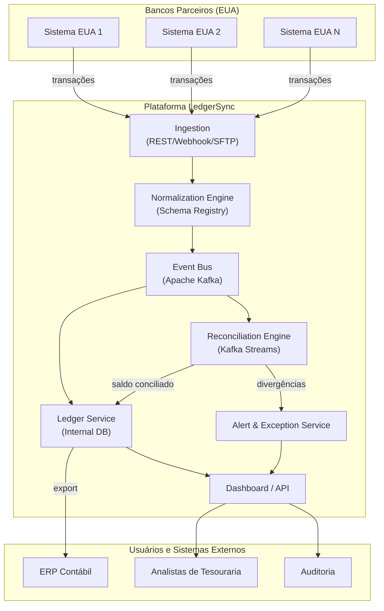
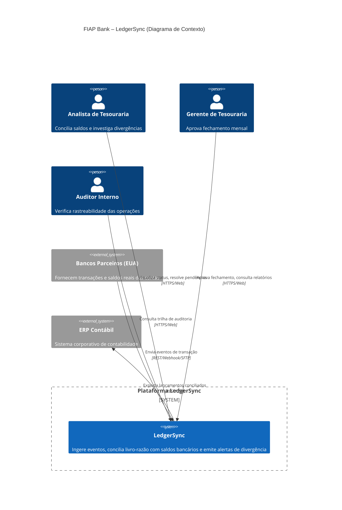
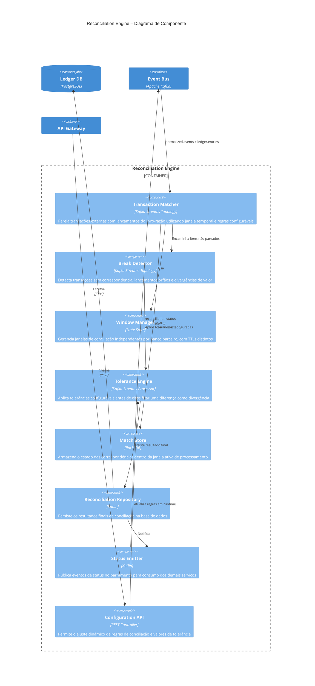

# FIAP Bank – LedgerSync: Plataforma de Reconciliação Financeira

> **Disciplina:** IT Architecture Design-Styles  
> **Professor:** Leonardo Pinho  
> **Tema:** Open Banking & Arquitetura Orientada a Eventos  

## 1. Story Telling – O Problema e o Tema

O departamento de tesouraria do FIAP Bank enfrenta, mensalmente, um obstáculo que compromete toda a operação: o fechamento do caixa. A instituição movimenta milhares de transações internacionais diariamente entre Brasil e Estados Unidos, abrangendo câmbio, transferências, taxas e estornos. Entretanto, o momento de conciliar o saldo do livro-razão interno com o saldo real das contas nos bancos parceiros americanos revela um processo frágil, artesanal e propenso a erros.

O procedimento atual depende de exportações manuais de planilhas de sistemas distintos e de horas de cruzamento de dados pelos analistas. Qualquer divergência, ainda que de centavos, paralisa o fechamento contábil. A origem do problema reside na assimetria das fontes de dados: o livro-razão opera em ciclos de lote diário, enquanto as contas bancárias flutuam em tempo real com liquidações, estornos e tarifas bancárias. Conciliar uma fonte estática com uma fonte dinâmica, sem automação, é ineficiente e arriscado.

O tema escolhido é Open Banking com Arquitetura Orientada a Eventos e Data Streaming. A proposta consiste em desenvolver o LedgerSync, uma plataforma que captura eventos transacionais em tempo real diretamente dos bancos parceiros, executa a conciliação automática com o livro-razão interno e notifica imediatamente qualquer divergência identificada, eliminando a dependência do fechamento mensal para a detecção de problemas.

## 2. O Que Esperamos Aprender com Este Projeto

O trabalho permite explorar na prática os seguintes conhecimentos:

- Como projetar uma arquitetura orientada a eventos para resolver um problema real de conciliação financeira, aplicando padrões arquiteturais estabelecidos.
- Como utilizar a notação C4 (Contexto, Contêiner, Componente) como instrumento de comunicação de decisões arquiteturais para diferentes públicos.
- Como identificar e priorizar Requisitos Arquitetonicamente Significativos que efetivamente guiem as escolhas de design.
- Como modelar um domínio financeiro complexo com eventos de negócio, streams de dados e o conceito de partidas dobradas contábeis.
- Como avaliar uma arquitetura de software de forma criteriosa, confrontando-a com perguntas específicas sobre atributos de qualidade.

## 3. Perguntas Que Precisam Ser Respondidas

1. Como capturar eventos transacionais em tempo real de múltiplos bancos parceiros, cada qual operando com seu formato proprietário de dados?
2. Como modelar o estado do livro-razão para refletir o saldo real com a menor latência possível?
3. Qual estratégia de reconciliação oferece o melhor equilíbrio: processamento em lote, em streaming ou uma combinação de ambas?
4. Como assegurar idempotência no reprocessamento de eventos financeiros, impedindo que duplicidades corrompam os saldos contábeis?
5. Como tratar as divergências que o sistema não consegue resolver de forma inteiramente automatizada?

## 4. Principais Riscos

| Risco | Impacto | Probabilidade |
|---|---|---|
| Inconsistência entre livro-razão e saldo real decorrente de eventos processados em duplicidade | Alto | Média |
| Latência excessiva no pipeline de eventos, resultando em alertas entregues com atraso | Alto | Média |
| Heterogeneidade nos formatos de eventos enviados pelos diferentes bancos parceiros | Médio | Alta |
| Resistência da equipe de tesouraria em abandonar o processo manual já estabelecido | Médio | Alta |
| Vazamento de dados financeiros sensíveis em qualquer ponto do pipeline | Crítico | Baixa |
| Sobrecarga da plataforma durante os picos de fechamento mensal | Alto | Média |

## 5. Plano Para Aprender o Necessário

| Conhecimento a adquirir | Estratégia de aprendizado | Prazo estimado |
|---|---|---|
| Padrões de arquitetura orientada a eventos: Event Sourcing, CQRS, Saga | Estudo dirigido e desenvolvimento de prova de conceito interna | Semana 1-2 |
| Integração com APIs de Open Banking (Bacen, instituições financeiras dos EUA) | Leitura de documentação oficial e experimentação em ambiente sandbox | Semana 2-3 |
| Apache Kafka e Kafka Streams para processamento de streams | Laboratório prático com cluster local | Semana 2-3 |
| Modelagem de domínio contábil com partidas dobradas | Sessão de trabalho com especialista contábil do banco | Semana 1 |
| Comparação entre estratégias de reconciliação batch e streaming | Spike técnico com métricas comparativas | Semana 3 |

## 6. Plano Para Reduzir os Riscos

| Risco | Medida de mitigação |
|---|---|
| Eventos duplicados | Implementação de idempotência por meio de chave de idempotência e deduplicação no broker de mensageria |
| Latência no pipeline | Particionamento por conta no Kafka com consumidores paralelos e escaláveis horizontalmente |
| Formatos heterogêneos entre bancos | Camada de normalização com Schema Registry centralizado atuando como camada anticorrupção |
| Resistência da equipe de tesouraria | Interface de usuário simplificada e período de operação assistida em modo sombra |
| Vazamento de dados sensíveis | Criptografia TLS 1.3 em trânsito e AES-256 em repouso; anonimização de dados em ambientes de desenvolvimento e teste |
| Pico de carga no fechamento mensal | Auto-scaling dos consumidores no Kubernetes; dimensionamento elástico da infraestrutura |

## 7. Partes Interessadas (Stakeholders)

Para identificar as partes interessadas, partimos de três perguntas fundamentais: quem está financiando o projeto, quem utilizará o produto resultante e quais são os potenciais conflitos de interesse entre os envolvidos. O mapeamento resultante é o seguinte:

- **Diretoria Financeira (CFO):** patrocinadora do projeto e responsável última pelo processo de fechamento contábil. Seu principal interesse é reduzir o ciclo de fechamento e o custo operacional associado.
- **Tesouraria (Analistas e Gerentes):** equipe que hoje executa manualmente a conciliação e será a principal impactada pela transição para o novo sistema. Os analistas concentram-se na operação diária; os gerentes, na aprovação do fechamento e na investigação de divergências críticas.
- **Tecnologia da Informação:** responsável por construir, manter e evoluir a plataforma. Busca uma arquitetura moderna, escalável e com baixa carga de manutenção operacional.
- **Compliance e Auditoria Interna:** área que necessita de rastreabilidade completa e registros imutáveis para atender às exigências regulatórias e aos processos internos de auditoria.
- **Bancos Parceiros (EUA):** instituições financeiras que mantêm as contas do FIAP Bank no exterior e fornecem os dados transacionais que alimentam a plataforma.
- **Reguladores (Bacen, SIPC):** entidades que fiscalizam a conformidade da instituição e exigem que a posição financeira reportada seja fidedigna.

Existe um conflito de interesse relevante entre a área de Compliance, que demanda controles rigorosos e auditoria exaustiva, e a Tesouraria, que valoriza agilidade e simplicidade no processo de conciliação. A arquitetura precisa equilibrar ambas as necessidades sem sacrificar nenhuma delas.

## 8. O Que Cada Stakeholder Espera Obter

| Stakeholder | Expectativa principal |
|---|---|
| CFO | Ciclo de fechamento contábil reduzido de dias para horas; diminuição de erros operacionais; corte de custos com retrabalho |
| Tesouraria (Analistas) | Eliminação do cruzamento manual de planilhas; detecção de divergências em tempo real, e não apenas no fim do mês |
| Tesouraria (Gerentes) | Aprovação do fechamento com dados confiáveis; visão consolidada e atualizada da posição financeira |
| Tecnologia da Informação | Stack tecnológica moderna, com desacoplamento entre componentes e baixa sobrecarga de manutenção |
| Compliance e Auditoria | Trilha de auditoria imutável; rastreabilidade completa de cada lançamento, da origem bancária ao registro contábil |
| Bancos Parceiros | Integração padronizada e redução de chamados por divergências entre sistemas |
| Reguladores | Garantia de que a posição financeira reportada corresponde aos saldos reais e pode ser auditada integralmente |

## 9. Quem São os Usuários

- **Analistas de Tesouraria:** executam a conciliação diária dos saldos; são os principais usuários operacionais da plataforma.
- **Gerentes de Tesouraria:** aprovam o fechamento mensal e conduzem a investigação de divergências de maior criticidade.
- **Auditores Internos:** consultam o histórico de reconciliações para verificar a conformidade dos processos.
- **Sistemas Externos:** as APIs dos bancos parceiros e o ERP contábil corporativo, considerados atores no modelo C4 ainda que não sejam pessoas.

## 10. O Que Cada Usuário Deseja Realizar

- **Analistas:** conferir se o saldo do livro-razão coincide com o saldo bancário real; classificar os tipos de divergência encontrados; resolver as pendências dentro do prazo operacional.
- **Gerentes:** aprovar o fechamento mensal com segurança, baseados em dados consolidados e rastreáveis; ter acesso imediato à visão geral da saúde financeira das contas sob sua responsabilidade.
- **Auditores:** rastrear qualquer lançamento contábil desde sua origem — o evento recebido do banco parceiro — até seu registro final no ERP, sem lacunas ou inconsistências.
- **Sistemas Externos:** enviar e receber eventos de transação de maneira confiável, com garantia de entrega e preservação da integridade dos dados.

## 11. Pior Cenário Possível

O pior cenário consiste em uma divergência material não detectada entre o livro-razão e o saldo real das contas, levando o FIAP Bank a reportar incorretamente sua posição financeira aos órgãos reguladores. As consequências incluiriam multas de valor elevado aplicadas pelo Bacen, questionamentos da SIPC nos Estados Unidos, risco concreto de perda da licença operacional e, sobretudo, dano irreparável à reputação da instituição. Considerando que a confiança constitui um dos valores fundamentais do banco — expresso em seus princípios de Ética, Transparência e Confiança —, o impacto seria catastrófico e potencialmente terminal para a operação internacional.

## 12. Diagrama de Arquitetura — Modelo Freeform (Versão Inicial)

O diagrama a seguir representa o primeiro esboço da arquitetura, elaborado durante a fase de concepção da solução:



## 13. Descrição de Cada Componente

| Componente | Responsabilidade |
|---|---|
| **Sistemas Bancários (EUA)** | Fontes externas que detêm a verdade sobre os saldos reais das contas. Enviam eventos de transação (débito, crédito, estorno, taxa) nos formatos proprietários de cada instituição. |
| **Ingestion** | Porta de entrada da plataforma. Recebe dados por REST, Webhook ou SFTP, autentica a origem, valida a estrutura e encaminha cada evento para a camada seguinte. |
| **Normalization Engine** | Camada anticorrupção que converte os formatos heterogêneos recebidos para um schema canônico único da plataforma. Utiliza Schema Registry para versionamento e governança dos esquemas de eventos. |
| **Event Bus (Apache Kafka)** | Espinha dorsal assíncrona do sistema. Oferece durabilidade dos eventos, ordenação por conta e partição, capacidade de replay e permite que múltiplos consumidores processem os mesmos eventos de forma independente. |
| **Reconciliation Engine** | Núcleo funcional da plataforma. Consome simultaneamente os eventos externos normalizados e os lançamentos do livro-razão, comparando-os dentro de janelas temporais configuráveis por banco parceiro. Classifica cada par como match, break ou pendente. |
| **Ledger Service** | Mantém o livro-razão interno do FIAP Bank, operando no modelo contábil de partidas dobradas. Cada lançamento é registrado de forma imutável e funciona como fonte de verdade para a posição financeira reportada pela instituição. |
| **Alert & Exception Service** | Notifica os analistas de tesouraria sobre divergências que o Reconciliation Engine não conseguiu resolver automaticamente. Gera tickets de investigação e gerencia o fluxo de trabalho até a resolução. |
| **Dashboard / API** | Interface web para os analistas e gerentes visualizarem o status das conciliações, os relatórios de fechamento e as divergências pendentes. Disponibiliza API REST para integração com o ERP contábil. |

## 14. Requisitos Arquitetonicamente Significativos (ASR)

Um requisito arquitetonicamente significativo é aquele que influencia de modo determinante as decisões sobre a estrutura da arquitetura. Classificamos os ASR do LedgerSync em quatro categorias: restrições, atributos de qualidade, requisitos funcionais de alto impacto e outros fatores que condicionam as escolhas de design.

### Restrições

Toda arquitetura opera dentro de limites. As restrições podem ser de natureza técnica ou de negócio e, por definição, reduzem o espaço de soluções possíveis.

- **Prazo de entrega do MVP:** três meses até a primeira versão operacional, o que impõe disciplina de escopo e favorece o reuso de componentes maduros.
- **Ambiente obrigatório:** a plataforma deve ser executada em nuvem AWS, por política corporativa já estabelecida no banco.
- **Composição da equipe:** o time de engenharia disponível possui experiência consolidada em Kotlin, Python e PostgreSQL, mas não domina linguagens como Elixir ou bancos especializados como EventStoreDB. Essa realidade restringe as opções tecnológicas viáveis.
- **Protocolos dos bancos parceiros:** as instituições financeiras nos EUA comunicam-se por REST, Webhook ou SFTP. Não há viabilidade de impor um protocolo único, o que obriga a plataforma a ser flexível na camada de entrada.

### Atributos de Qualidade

Os atributos de qualidade descrevem propriedades observáveis externamente que caracterizam o comportamento do sistema em condições específicas de operação. Para cada atributo, definimos um cenário concreto que a arquitetura precisa satisfazer.

| Atributo | Cenário de referência | Decisão arquitetural decorrente |
|---|---|---|
| Confiabilidade | Um banco parceiro permanece indisponível por duas horas durante o dia útil | Dead-letter queue no Kafka com política de retry exponencial; nenhum evento é perdido |
| Desempenho | Pico de cinquenta mil transações na hora do fechamento mensal | Particionamento por identificador de conta; consumidores paralelos com auto-scaling no Kubernetes |
| Segurança | Dados de saldo e transação trafegam entre todos os componentes da plataforma | TLS 1.3 em trânsito; AES-256 em repouso; anonimização de dados em ambientes não produtivos |
| Disponibilidade | O Reconciliation Engine sofre uma falha durante uma janela de conciliação ativa | Kafka Streams com state store em RocksDB; reprocessamento a partir do último offset confirmado |
| Modificabilidade | Um novo banco parceiro precisa ser integrado com formato de eventos proprietário | Camada anticorrupção extensível por meio de adaptadores; Schema Registry com versionamento independente por banco |

### Requisitos Funcionais de Impacto Arquitetural

Nem todo requisito funcional é arquitetonicamente relevante. Destacamos aqueles cuja implementação impõe restrições estruturais ao sistema.

- **Processamento idempotente de eventos financeiros:** exige a presença de chave de idempotência em todas as camadas de consumo e mecanismo de deduplicação no broker.
- **Rastreabilidade completa de cada lançamento:** impõe que todos os eventos carreguem um identificador de correlação preservado desde a camada de ingestão até a exportação para o ERP.
- **Janela de conciliação variável por banco parceiro:** obriga o Reconciliation Engine a gerenciar múltiplas janelas temporais simultâneas, cada uma com TTL próprio, armazenadas em state store.
- **Interface para reconciliação manual assistida:** o Dashboard precisa oferecer uma funcionalidade de sugestão de correspondência provável, permitindo que o analista confirme ou rejeite a sugestão.

### Outros Fatores que Influenciam a Arquitetura

- **Prazo e orçamento:** o horizonte de três meses para o MVP impõe um escopo enxuto e favorece componentes que a equipe já domina.
- **Experiência prévia da equipe:** a familiaridade com PostgreSQL e Kafka direcionou naturalmente as escolhas de persistência e mensageria.
- **Preferências arquiteturais:** a inclinação por Event Sourcing decorre de experiências anteriores positivas do time, mas foi validada contra os requisitos reais do problema antes de ser adotada como diretriz.

## 15. Sobre o Que o Diagrama Ajuda a Raciocinar

O diagrama Freeform orienta a reflexão sobre quatro aspectos centrais da solução:

- **Separação de responsabilidades:** cada componente tem uma função claramente delimitada — ingestão, normalização, conciliação, persistência e notificação. Essa organização facilita a discussão sobre cada etapa do fluxo e permite que diferentes membros da equipe se concentrem em partes específicas do sistema.
- **Desacoplamento por meio do Event Bus:** o Kafka atua como ponto único de integração entre componentes. Nenhum módulo comunica-se diretamente com outro; a comunicação sempre passa pelo barramento de eventos, o que viabiliza a evolução independente de cada serviço.
- **Duas fontes de verdade em confronto:** o livro-razão interno e os sistemas bancários externos representam duas realidades que precisam ser comparadas. O sistema não presume que uma delas seja a verdade absoluta; sua função é justamente identificar onde elas divergem.
- **Divergência como evento de negócio, não como erro de sistema:** divergências não são tratadas como exceções técnicas, mas como ocorrências previstas no domínio, que exigem um fluxo de trabalho específico para investigação e resolução.

## 16. Padrões Arquiteturais Empregados

A arquitetura do LedgerSync apoia-se em padrões estabelecidos que promovem atributos de qualidade específicos. Abaixo, relacionamos os padrões identificados e sua manifestação concreta no sistema.

### Padrões Estruturais

- **Camadas (Layered Architecture):** a plataforma organiza-se em camadas lógicas com responsabilidades segregadas: camada de entrada (Ingestion), camada de transformação (Normalization + Event Bus), camada de domínio (Reconciliation + Ledger) e camada de apresentação (Dashboard). As camadas superiores dependem das inferiores; não há dependências cíclicas.
- **Portas e Adaptadores (Ports and Adapters):** o Normalization Engine expõe portas na forma de schemas canônicos de eventos. Cada banco parceiro é tratado como um adaptador de entrada que implementa a interface definida pela porta correspondente. O ERP contábil atua como adaptador de saída. Essa estrutura isola a lógica central de domínio dos detalhes de infraestrutura externa.
- **Pipe and Filter:** o fluxo Ingestion → Normalization → Kafka → Reconciliation → Ledger constitui um pipeline onde cada estágio representa um filtro que aplica uma transformação específica sobre os dados. Os tópicos do Kafka funcionam como pipes que transportam os eventos entre filtros, preservando a ordem das mensagens.

### Padrões de Integração

- **Arquitetura Orientada a Eventos (Event-Driven Architecture):** o Kafka opera como backbone de comunicação assíncrona. Os componentes publicam e consomem eventos sem acoplamento direto entre si. Cada serviço pode ser implantado, escalado e atualizado de forma independente.
- **Event Sourcing:** o Ledger Service armazena a sequência completa e imutável de eventos contábeis, em vez de manter apenas o saldo corrente. Essa escolha permite reconstruir o estado financeiro em qualquer ponto do tempo, atende diretamente ao requisito de auditoria e possibilita a criação de novas projeções no futuro sem alterar os dados originais.
- **CQRS (Command Query Responsibility Segregation):** o Reconciliation Engine é responsável pela escrita dos resultados de conciliação, enquanto o Dashboard realiza consultas às projeções materializadas do Ledger Service. Os caminhos de escrita e leitura são fisicamente segregados e otimizados para suas respectivas cargas de trabalho.

## 17. Padrões Ocultos

Uma análise mais aprofundada revela padrões que não estão explicitamente desenhados no diagrama, mas cuja presença é necessária para o funcionamento correto da plataforma:

- **Outbox Pattern:** o Ledger Service precisa garantir que a persistência do evento no banco de dados e a publicação da mensagem no Kafka ocorram de forma atômica. Se o banco confirmar a escrita e o Kafka falhar em receber a mensagem, o sistema perde a consistência. O padrão Outbox resolve esse problema escrevendo primeiro em uma tabela de saída dentro da mesma transação do banco e, em seguida, publicando a mensagem de forma assíncrona com garantia de entrega.
- **Saga Coreografada:** o fluxo completo de reconciliação — receber evento externo, normalizar, comparar com o livro-razão, decidir match ou break, persistir o resultado e notificar — pode ser interpretado como uma saga de múltiplos passos. Se qualquer etapa falhar, as anteriores precisam ser compensadas para manter a consistência do sistema.
- **Strangler Fig:** a substituição do processo manual de conciliação não será abrupta. Durante um período de transição, a nova plataforma operará em modo sombra, processando os mesmos dados que o processo legado. Os resultados de ambos serão comparados até que a confiabilidade do novo sistema seja comprovada, momento em que o processo antigo será gradualmente desativado.

## 18. Metamodelo

O metamodelo define os conceitos fundamentais que estruturam o domínio da reconciliação financeira e as relações entre eles:

```
Cliente (1) ─── (N) Conta ─── (1) Banco Parceiro
                           │
                           └── (N) Transação (externa)
                                            │
Ledger (1) ─── (N) Lançamento Contábil ────┘ (match 0..1)
                                            │
Reconciliação (N) ─── (2) [Transação + Lançamento]
                                            │
Divergência (0..N) ─── (1) Reconciliação
```

**Entidades principais:**

- **Conta:** representa uma conta bancária real mantida em uma instituição financeira parceira nos Estados Unidos.
- **Transação (externa):** evento originado no sistema do banco parceiro, representando uma movimentação financeira (débito, crédito, taxa ou estorno).
- **Lançamento Contábil:** registro no livro-razão interno do FIAP Bank, obedecendo ao princípio contábil das partidas dobradas.
- **Reconciliação:** processo que estabelece o pareamento entre uma ou mais transações externas e seus correspondentes lançamentos contábeis.
- **Divergência:** situação em que o pareamento não pode ser estabelecido, classificada como lançamento órfão (existe na ledger mas não no extrato), transação faltante (existe no extrato mas não na ledger) ou diferença de valor entre as duas fontes.

## 19. O Metamodelo Pode Ser Discernido no Diagrama Único?

Apenas parcialmente. O diagrama Freeform representa com clareza a estrutura de componentes e os fluxos de dados entre eles, mas o metamodelo — com suas entidades, relacionamentos e cardinalidades — não está visível nessa representação. Para expressar completamente o metamodelo, seria necessário um diagrama de classes ou um modelo entidade-relacionamento complementar. A notação C4 endereça essa limitação ao distribuir a informação em níveis progressivos de detalhamento: o diagrama de Contexto mostra os atores e sistemas; o de Contêiner revela a estrutura técnica e as tecnologias empregadas; o de Componente expõe como as entidades do metamodelo trafegam e são processadas dentro de cada serviço.

## 20. O Diagrama Está Completo?

Não. O diagrama Freeform cobre adequadamente o fluxo principal e os componentes essenciais, mas omite aspectos relevantes que seriam necessários em uma documentação arquitetural completa:

- Mecanismos de resiliência: filas de mensagens mortas, políticas de retentativa, circuit breakers para isolar falhas.
- Infraestrutura transversal: sistema de observabilidade com logs estruturados, métricas de negócio e técnica, tracing distribuído entre serviços; camada de autenticação e autorização.
- Processos em lote complementares: o fechamento contábil mensal pode ainda exigir jobs de consolidação que operem sobre dados agregados, em complemento ao processamento em streaming.
- Período de operação em modo sombra: a fase de validação em que a plataforma roda em paralelo ao processo manual legado, essencial para a transição segura, não está representada.

## 21. O Diagrama Poderia Ser Simplificado Mantendo Sua Eficácia?

Sim. Para um público não técnico — como a diretoria financeira ou o CFO — uma representação reduzida comunicaria a mensagem central com mais clareza:

> **Bancos Parceiros → LedgerSync → Tesouraria / ERP**

Essa visão minimalista corresponde exatamente ao nível de Contexto do modelo C4. O detalhamento dos componentes internos (Kafka, Schema Registry, Reconciliation Engine) é relevante apenas para o público de engenharia e arquitetura de software. A principal qualidade da notação C4 reside precisamente nessa capacidade de oferecer o nível de abstração adequado a cada interlocutor, sem omitir informação nem sobrecarregar quem não precisa dela.

## 22. Discussões Relevantes da Equipe

Durante a elaboração do projeto, três debates consumiram mais tempo e produziram os aprendizados mais valiosos:

1. **Reconciliação em lote versus em streaming:** a equipe dividiu-se entre a simplicidade de um job noturno de conciliação e a agilidade de um pipeline de streaming contínuo. A decisão final favoreceu uma abordagem híbrida: o streaming alimenta alertas em tempo real e mantém a operação diária sob controle; o processamento em lote é mantido para o fechamento oficial mensal, que exige maior rigor e permite verificações adicionais.

2. **Modelo de persistência do livro-razão:** a escolha entre Event Sourcing com consistência eventual e um modelo CRUD tradicional com transações ACID gerou discussões intensas. O Event Sourcing prevaleceu porque o histórico imutável de eventos resolve de forma natural o requisito de auditoria. Para mitigar a complexidade de consulta, foram adicionadas projeções materializadas que evitam a recomputação do saldo a cada requisição.

3. **A qual domínio pertence a reconciliação:** questionamos se a reconciliação deveria ser parte do contexto delimitado do Livro-Razão ou se constituía um domínio separado. Optamos pela segregação: o Livro-Razão é a fonte de verdade contábil; a Reconciliação é o processo autônomo que compara duas fontes de verdade distintas e produz seu próprio registro de matches e divergências.

## 23. Decisões Que a Equipe Teve Dificuldade Para Tomar

1. **Escolha do broker de mensageria:** Apache Kafka exige maior esforço de infraestrutura e operação, mas oferece replay de eventos e ordenação por partição — características críticas em um domínio financeiro. Alternativas gerenciadas como Amazon SQS e SNS reduziriam a carga operacional, mas não entregariam as mesmas garantias de ordenação e reentrega. Kafka prevaleceu pela adequação aos requisitos.

2. **Tecnologia de armazenamento do livro-razão:** PostgreSQL com uma tabela dedicada de eventos oferece maturidade, ecossistema de ferramentas e familiaridade da equipe. Um banco especializado como EventStoreDB traria facilidades nativas para Event Sourcing, mas introduziria uma tecnologia nova no stack, com curva de aprendizado e riscos operacionais associados. A familiaridade da equipe foi o fator decisivo.

3. **Linguagem do Reconciliation Engine:** Python oferece prototipagem rápida e é a linguagem de conforto do time de dados. Kotlin, por outro lado, integra-se nativamente com Kafka Streams e oferece garantias superiores de tipo e desempenho em produção. Optou-se por Kotlin, reconhecendo que a velocidade inicial de desenvolvimento seria sacrificada em favor da robustez em ambiente produtivo.

## 24. Decisões Tomadas Sob Incerteza

1. **Dimensionamento do Kafka:** sem acesso a dados históricos reais do FIAP Bank, adotamos uma postura conservadora: cem partições, com auto-scaling de consumidores desde a concepção inicial. O custo de superdimensionar é financeiro e temporário; o custo de subdimensionar seria a paralisação do pipeline em um momento crítico.

2. **Adoção de blockchain:** as informações do caso mencionam blockchain como possibilidade tecnológica. Após análise, concluímos que o Event Sourcing já entrega o principal benefício atribuído ao blockchain nesse contexto — rastreabilidade imutável. Incluir um ledger distribuído neste momento acrescentaria complexidade sem benefício proporcional. A arquitetura foi projetada de modo que, se futuramente houver a necessidade de compartilhar trilhas de auditoria com entidades externas de forma descentralizada, uma camada de DLT poderá ser acoplada sem reestruturação do núcleo.

3. **Número e protocolos dos bancos parceiros:** não temos visibilidade sobre quantas instituições serão integradas nem quais protocolos utilizarão. A camada anticorrupção foi projetada como extensível, com um adaptador por banco, mas o esforço concreto de integração permanece como a principal incógnita do projeto.

## 25. Ponto de Decisão Sem Retorno

A adoção do Event Sourcing como padrão de persistência do livro-razão constitui o principal ponto de não retorno da arquitetura. Uma vez que os eventos passam a ser a fonte primária de verdade do sistema:

- Migrar posteriormente para um modelo CRUD tradicional exigiria reescrever toda a camada de domínio e reprocessar o histórico integral de eventos.
- Todas as consultas, relatórios e integrações externas passam a depender das projeções materializadas, criando uma dependência arquitetural que se aprofunda com o tempo.
- O custo e o risco de reverter essa decisão após a entrada em produção seriam proibitivos.

Em contrapartida, a decisão desbloqueia capacidades que seriam difíceis de obter de outra forma: replay completo do histórico transacional para qualquer período, trilha de auditoria imutável por construção do modelo de dados e a possibilidade de responder a novas perguntas de negócio simplesmente criando projeções adicionais sobre o mesmo fluxo de eventos, sem tocar nos dados originais.

## 26 a 29. Documentação Arquitetural no Modelo C4

### 26-27. Nível 1: Diagrama de Contexto

O diagrama de Contexto apresenta a plataforma LedgerSync como uma caixa única no centro, rodeada pelos atores humanos e sistemas externos com os quais interage. É o nível adequado para comunicar a arquitetura a executivos e stakeholders não técnicos.



### 28. Nível 2: Diagrama de Contêiner

O diagrama de Contêiner expande a plataforma, revelando os serviços, bancos de dados e infraestrutura de mensageria que a compõem. Este nível é direcionado a arquitetos de software, engenheiros e equipes de operações.

```mermaid
C4Container
    title FIAP Bank – LedgerSync (Diagrama de Contêiner)

    Person(analista, "Analista de Tesouraria")
    Person(gerente, "Gerente de Tesouraria")
    Person(auditor, "Auditor Interno")

    System_Ext(banco_parceiro, "Bancos Parceiros (EUA)")
    System_Ext(erp, "ERP Contábil")

    System_Boundary(ledgersync, "Plataforma LedgerSync") {
        Container(webapp, "Dashboard SPA", "React + TypeScript", "Interface para analistas, gerentes e auditores")
        Container(api, "API Gateway", "Kotlin + Spring Boot", "Autenticação, rate limiting e roteamento de requisições")
        Container(ingestion, "Ingestion Service", "Go", "Recebe eventos dos bancos parceiros via REST, Webhook ou SFTP")
        Container(normalizer, "Normalization Service", "Kotlin", "Converte formatos proprietários para o schema canônico da plataforma")
        Container(kafka, "Event Bus", "Apache Kafka", "Barramento assíncrono com particionamento por conta")
        Container(recon_engine, "Reconciliation Engine", "Kotlin + Kafka Streams", "Compara eventos externos com o livro-razão e detecta divergências")
        Container(ledger_svc, "Ledger Service", "Kotlin + Spring Boot", "Mantém o livro-razão interno com Event Sourcing")
        Container(alert_svc, "Alert & Exception Service", "Kotlin", "Notifica divergências e gerencia o fluxo de investigação")
        ContainerDb(ledger_db, "Ledger DB", "PostgreSQL", "Armazenamento de eventos e projeções materializadas")
        ContainerDb(cache, "Cache", "Redis", "Saldos recentes, sessões de usuário e controle de taxa")
        Container(schema_reg, "Schema Registry", "Confluent", "Versionamento e governança de esquemas de eventos")
    }

    Rel(analista, webapp, "Usa o sistema", "HTTPS")
    Rel(gerente, webapp, "Usa o sistema", "HTTPS")
    Rel(auditor, webapp, "Usa o sistema", "HTTPS")
    Rel(webapp, api, "Chama a API", "REST/HTTPS")
    
    Rel(banco_parceiro, ingestion, "Envia transações", "REST/Webhook/SFTP")
    Rel(ingestion, kafka, "Publica evento bruto", "Kafka")
    Rel(kafka, normalizer, "Consome evento bruto", "Kafka")
    Rel(normalizer, kafka, "Publica evento normalizado", "Kafka")
    Rel(normalizer, schema_reg, "Valida e registra schema", "REST")
    
    Rel(kafka, recon_engine, "Consome eventos normalizados", "Kafka Streams")
    Rel(kafka, ledger_svc, "Consome eventos normalizados", "Kafka")
    Rel(ledger_svc, ledger_db, "Lê e escreve eventos", "JDBC")
    Rel(recon_engine, ledger_db, "Consulta projeções do livro-razão", "JDBC")
    Rel(recon_engine, kafka, "Publica eventos de match e break", "Kafka")
    Rel(kafka, alert_svc, "Consome eventos de break", "Kafka")
    Rel(alert_svc, kafka, "Publica alerta processado", "Kafka")
    
    Rel(api, kafka, "Consome eventos de status", "Kafka")
    Rel(ledger_svc, erp, "Exporta lançamentos conciliados", "REST")
```



### 29. Nível 3: Diagrama de Componente — Reconciliation Engine

O diagrama de Componente detalha a estrutura interna do Reconciliation Engine, o contêiner mais complexo da plataforma. Este nível é voltado para desenvolvedores que precisam compreender a organização do código e as responsabilidades de cada módulo.



### 30. Nível 4: Código (Opcional)

Abaixo, a estrutura de pacotes proposta para o Ledger Service, implementado em Kotlin com Spring Boot. A organização segue os princípios de Domain-Driven Design, com separação clara entre domínio, aplicação e infraestrutura.

```
com.fiapbank.ledgersync
├── ledger
│   ├── domain
│   │   ├── LedgerEntry.kt          // entidade: lançamento contábil
│   │   ├── AccountId.kt            // value object: identificador de conta
│   │   ├── Money.kt                // value object: valor monetário com moeda
│   │   ├── EntryType.kt            // enum: DEBIT, CREDIT
│   │   └── LedgerAggregate.kt      // aggregate root: livro-razão por conta
│   ├── events
│   │   ├── EntryRecorded.kt        // evento de domínio: lançamento registrado
│   │   ├── ReconciliationMatched.kt // evento: conciliação bem-sucedida
│   │   └── ReconciliationBroke.kt  // evento: divergência detectada
│   ├── infrastructure
│   │   ├── EventStore.kt           // persistência da cadeia de eventos
│   │   ├── Projection.kt           // construção de projeções materializadas
│   │   └── KafkaPublisher.kt       // publicação de eventos com outbox pattern
│   └── application
│       ├── RecordEntryUseCase.kt   // caso de uso: registrar lançamento
│       ├── GetBalanceQuery.kt      // consulta: obter saldo por conta
│       └── GetAuditTrailQuery.kt   // consulta: obter trilha de auditoria
```

## 31. Avaliação da Arquitetura

Submetemos a arquitetura do LedgerSync a uma avaliação baseada em perguntas específicas e acionáveis. Para cada dimensão relevante, formulamos uma pergunta cuja resposta permite aferir se a arquitetura atende ao esperado ou se requer ajustes.

| Dimensão | Pergunta de avaliação | Situação atual |
|---|---|---|
| Confiabilidade | Se um banco parceiro ficar indisponível por duas horas, quantos eventos serão perdidos? | Nenhum. O mecanismo de dead-letter queue com retry exponencial garante a entrega de todos os eventos após o restabelecimento. |
| Desempenho | O pipeline suporta o volume de cinquenta mil transações por hora com latência inferior a trinta segundos? | A arquitetura foi projetada para esse volume, com particionamento por conta e consumidores paralelos. Testes de carga são necessários para confirmação empírica. |
| Segurança | Todos os dados sensíveis estão protegidos em trânsito e em repouso? | Sim. TLS 1.3 cobre toda a comunicação entre serviços; AES-256 protege os dados armazenados; ambientes de desenvolvimento utilizam dados anonimizados. |
| Modificabilidade | Qual o esforço para integrar um novo banco parceiro com formato de eventos proprietário? | É necessário desenvolver um novo adaptador na camada de normalização e registrar seu schema. O restante da plataforma não sofre alterações. |
| Completude da documentação | Os diagramas respondem às perguntas dos diferentes públicos interessados? | Sim. O Contexto atende o público executivo; o Contêiner atende arquitetos e operações; o Componente atende desenvolvedores. |
| Prontidão para entrada em produção | Existe um plano de transição validado com a equipe de tesouraria? | O conceito de modo sombra está definido tecnicamente, mas o cronograma e a operação assistida ainda precisam ser acordados com o stakeholder. |

Adicionalmente, realizamos a verificação dos diagramas C4 segundo a lista de revisão recomendada pela documentação oficial da notação:

| Critério de qualidade do diagrama | Contexto | Contêiner | Componente |
|---|---|---|---|
| Título e legenda estão presentes e são compreensíveis | Sim | Sim | Sim |
| Todo elemento possui identificação de nome e tipo | Sim | Sim | Sim |
| As setas indicam direção do fluxo e possuem descrição da interação | Sim | Sim | Sim |
| O diagrama mantém foco em um único nível de abstração | Sim | Sim | Sim |
| As tecnologias estão explicitadas nos rótulos dos elementos | Sim | Sim | Sim |
| Não há mistura entre níveis de abstração diferentes | Sim | Sim | Sim |
| O público-alvo do diagrama é identificável | Sim | Sim | Sim |


## Stack Tecnológica

| Camada | Tecnologia selecionada |
|---|---|
| Frontend | React com TypeScript |
| API Gateway | Kotlin com Spring Boot e Spring Cloud Gateway |
| Serviço de Ingestão | Go (alta concorrência e baixa latência) |
| Serviço de Normalização | Kotlin |
| Barramento de Eventos | Apache Kafka com Confluent Schema Registry |
| Motor de Reconciliação | Kotlin com Kafka Streams |
| Serviço de Livro-Razão | Kotlin com Spring Boot e PostgreSQL (event store) |
| Cache | Redis |
| Serviço de Alertas | Kotlin |
| Observabilidade | OpenTelemetry, Prometheus e Grafana |
| Infraestrutura | Kubernetes em AWS EKS, gerenciado com Terraform |


