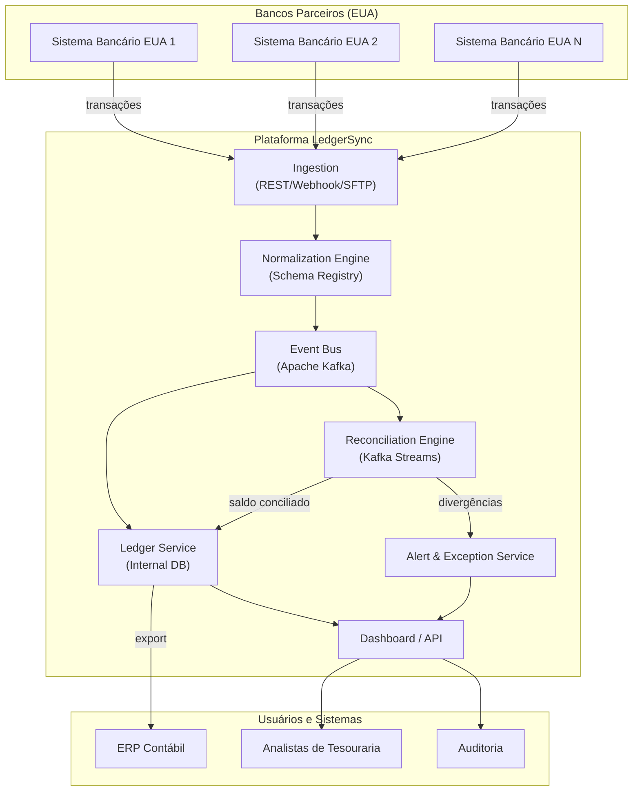
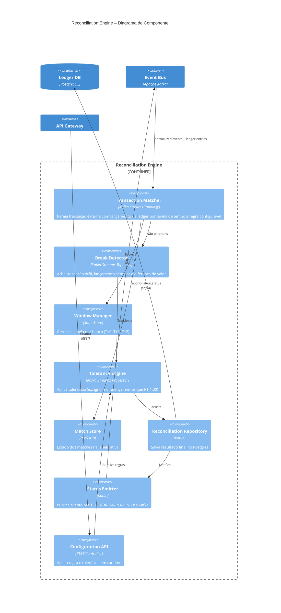

# FIAP Bank – LedgerSync: Plataforma de Reconciliação Financeira

> **Disciplina:** IT Architecture Design-Styles – C4 Model & Engenharia de Software  
> **Professor:** Leonardo Pinho  
> **Tema:** Fintech / Open Banking / Arquitetura Orientada a Eventos  

---

## 1. Story Telling – Qual é o problema e o tema?

Imagina a cena: todo mês o pessoal da tesouraria do **FIAP Bank** vira noites pra conseguir fechar o caixa. O banco mexe com investimento internacional, então tem transação saindo e chegando dos EUA o tempo todo — câmbio, transferência, taxa, estorno. Só que na hora de bater o que está na **ledger** (o livro-razão interno) com o saldo real que está nas contas dos bancos parceiros lá fora... vira um caos.

Hoje o processo é basicamente artesanal: exportam planilha de um lado, planilha do outro, ficam cruzando dados na mão e torcendo pra não ter diferença. E se tiver divergência — mesmo que seja centavo — o fechamento trava. O problema raiz é simples: a ledger opera em lote (batch), enquanto as contas nos bancos oscilam em tempo real. Um é estático, o outro dinâmico. Conciliar os dois sem automação é receita pra dor de cabeça.

A gente escolheu trabalhar com **Arquitetura Orientada a Eventos com Data Streaming** como tema, que casa direitinho com os valores do FIAP Bank de Pioneirismo e Tecnologia. A ideia é criar uma plataforma — batizada de **LedgerSync** — que fica ouvindo as transações conforme elas acontecem, concilia com a ledger automaticamente e já avisa se tem algo estranho, sem precisar esperar o fechamento do mês.

---

## 2. O que esperamos aprender com esse projeto?

A real é que a gente quer sair desse trabalho entendendo de verdade como funciona uma arquitetura orientada a eventos na prática, não só na teoria. As coisas que mais interessam:

- Como desenhar um sistema que resolve um problema de conciliação financeira com eventos e streaming
- Aplicar C4 Model de verdade — contexto, container, componente — e ver se ajuda mesmo a explicar arquitetura
- Modelar domínio financeiro que é cheio de regra e burocracia
- Entender os trade-offs chatos de consistência eventual versus tempo real

---

## 3. Que perguntas a gente precisa responder?

1. Como capturar eventos de transação de vários bancos diferentes em tempo real, cada um com seu formato maluco?
2. Como fazer a ledger refletir o saldo real com o mínimo de atraso possível?
3. Vale mais a pena processar em batch, streaming, ou um meio-termo?
4. Como evitar processar o mesmo evento duas vezes e bagunçar o saldo?
5. O que fazer quando o sistema não consegue resolver a divergência sozinho?

---

## 4. Quais são os principais riscos?

| Risco | Impacto | Chance |
|---|---|---|
| Processar evento duplicado e zoar o saldo da ledger | Alto | Média |
| Pipeline demorar demais e alerta chegar atrasado | Alto | Média |
| Cada banco mandar dado num formato diferente e a normalização virar um inferno | Médio | Alta |
| O time de tesouraria não confiar no sistema novo e continuar fazendo na mão | Médio | Alta |
| Dados financeiros vazarem | Crítico | Baixa |
| Sistema não aguentar o tranco no dia do fechamento mensal | Alto | Média |

---

## 5. Plano de aprendizado

| O que estudar | Como | Quando |
|---|---|---|
| Event Sourcing, CQRS, Saga (padrões de evento) | Estudar documentação e fazer uma PoC | Semana 1-2 |
| APIs de Open Banking (Bacen e bancos EUA) | Ler documentação oficial, testar sandbox | Semana 2-3 |
| Kafka e Kafka Streams | Mão na massa, subir cluster local | Semana 2-3 |
| Como funciona uma ledger contábil de verdade (double-entry) | Chamar um contador pra explicar, sem zoeira | Semana 1 |
| Batch vs Streaming pra conciliação | Fazer um spike técnico e comparar | Semana 3 |

---

## 6. Plano pra reduzir os riscos

| Risco | Como mitigar |
|---|---|
| Evento duplicado | Idempotency-key + deduplicação no próprio Kafka |
| Latência no pipeline | Particionar por conta; parallel consumers; monitorar lag |
| Formatos diferentes de cada banco | Anti-corruption layer com schema registry padronizando tudo |
| Resistência do time da tesouraria | Rodar em shadow mode primeiro (sistema novo do lado do antigo) e UX bem simples |
| Vazamento de dados | TLS 1.3 em trânsito, AES-256 em repouso, dados mascarados em dev |
| Pico de carga no fechamento | Auto-scaling dos consumidores no Kubernetes |

---

## 7. Stakeholders (partes interessadas)

- **CFO / Diretoria Financeira** — dono do processo, quer o fechamento mais rápido e sem erro
- **Tesouraria** — quem sofre hoje fazendo conciliação manual
- **TI / Engenharia** — vai construir e sustentar a plataforma
- **Compliance / Auditoria** — quer tudo rastreável e imutável
- **Bancos parceiros (EUA)** — mandam os dados de transação
- **Bacen / SIPC** — reguladores que exigem conformidade

---

## 8. O que cada stakeholder espera ganhar?

| Stakeholder | Expectativa |
|---|---|
| CFO | Fechamento em horas, não dias. Menos erro. Menos gente operacional. |
| Tesouraria | Chega de planilha. Saber na hora se tem algo errado, não no fim do mês. |
| TI | Stack moderna que escala e não dá dor de cabeça em produção. |
| Compliance | Auditoria com trilha imutável, sem "sumiu um lançamento". |
| Bancos parceiros | Integração padronizada, menos ticket de divergência pra resolver. |

---

## 9. Quem são os usuários?

- **Analistas de tesouraria** — usam diariamente pra conferir saldos
- **Gerentes de tesouraria** — aprovam fechamento e investigam coisa grave
- **Auditores internos** — consultam histórico pra auditoria
- **Sistemas externos** — APIs de bancos e o ERP contábil

---

## 10. O que cada usuário quer fazer?

- **Analista:** Ver se a ledger bate com o banco, classificar divergência, resolver pendência
- **Gerente:** Aprovar fechamento com segurança, ter visão geral da situação
- **Auditor:** Rastrear qualquer lançamento do começo ao fim, sem buraco
- **Sistemas:** Trocar evento de transação de forma confiável, sem perder nada

---

## 11. Pior cenário possível

O banco reportar posição financeira errada pros reguladores porque uma divergência passou batida. Resultado: multa pesada do Bacen, problema com a SIPC nos EUA, risco de perder licença e — pior — a confiança dos clientes. Sendo que "confiança" é um dos valores centrais do FIAP Bank. Ia ser catastrófico.

---

## 12. Arquitetura Freeform (versão inicial, rabiscada em discussão)

Abaixo o primeiro esboço que a gente fez enquanto discutia a solução:



---

## 13. O que cada componente faz

| Componente | Pra que serve |
|---|---|
| **Sistemas bancários (EUA)** | São os bancos parceiros que têm o saldo real. Cada um manda transação (débito, crédito, estorno, taxa) no seu formato. |
| **Ingestion** | Porta de entrada. Aceita REST, Webhook ou até SFTP. Valida que o evento é legítimo e encaminha. |
| **Normalization Engine** | Camada anti-corrupção. Pega o JSON maluco de cada banco e converte pra um formato padronizado interno. Schema Registry pra versionar. |
| **Event Bus (Kafka)** | A espinha dorsal. Tudo passa por aqui. Garante que evento não se perde, fica ordenado por conta e dá replay se precisar. |
| **Reconciliation Engine** | O coração do negócio. Fica ouvindo eventos dos bancos e eventos da ledger, pareia um com o outro, acha match e break. Janela de tempo configurável por banco. |
| **Ledger Service** | Mantém o livro-razão interno do FIAP Bank (partidas dobradas). Registro imutável de tudo que entra e sai. |
| **Alert & Exception Service** | Quando o Reconciliation Engine não consegue resolver, manda alerta pro time. Gerencia ticket de investigação. |
| **Dashboard / API** | Tela pros analistas e gerentes verem status, relatório, mexerem nas pendências. API expõe tudo pro ERP. |

---

## 14. Requisitos que a gente considera importantes (6 no total)

| # | Requisito | Por quê |
|---|---|---|
| 1 | **Idempotência nos eventos** | Processar um débito duas vezes quebra o saldo. Em finanças isso é gravíssimo. |
| 2 | **Rastreabilidade ponta a ponta** | Auditoria precisa conseguir seguir um lançamento desde o banco americano até o ERP contábil, sem salto. |
| 3 | **Janela de conciliação configurável por banco** | Cada banco liquida em um prazo (T+0, T+1, T+2). Se a janela for fixa, vai dar match errado. |
| 4 | **Criptografia em trânsito e em repouso** | Saldo de cliente é dado sensível. TLS 1.3 e AES-256. Em dev, dado mascarado. |
| 5 | **Resiliência — se um banco cair, não pode perder evento** | Dead-letter queue, retry com backoff exponencial. Kafka salva aqui porque armazena evento em disco. |
| 6 | **Interface pra resolver divergência manualmente** | Nem tudo vai ser automático. Precisa ter tela que sugere match provável e deixa o analista decidir. |

---

## 15. O que o diagrama ajuda a pensar?

Quando a gente desenhou esse Freeform, algumas coisas ficaram mais claras:

- **Separação de responsabilidades** — cada caixa faz uma coisa só: ingerir, normalizar, conciliar, persistir, alertar. Ficou mais fácil discutir cada parte.
- **O Event Bus como ponto de desacoplamento** — nenhum componente fala direto com outro. Tudo via Kafka. Isso facilita evoluir cada parte sozinha.
- **Duas fontes de verdade** — a ledger interna e os bancos externos. Não existe "a verdade". O sistema existe pra comparar as duas.
- **Divergência não é bug, é evento de negócio** — desde o começo a gente tratou "break" como algo normal que precisa de workflow, não como exceção de sistema.

---

## 16. Padrões essenciais que aparecem no diagrama

| Padrão | Onde |
|---|---|
| **Event-Driven Architecture** | Kafka como backbone. Comunicação assíncrona entre tudo. |
| **Pipes and Filters** | Ingestion → Normalization → Kafka → Reconciliation → Ledger. Cada estágio transforma o dado. |
| **Anti-Corruption Layer** | Normalization Engine isola o domínio interno dos formatos proprietários dos bancos. |
| **CQRS (separação implícita)** | O Reconciliation Engine escreve resultado; o Dashboard lê do Ledger Service. Caminhos diferentes. |
| **Event Sourcing** | A ledger guarda evento imutável em vez de "saldo atual". Dá pra reconstruir qualquer ponto no tempo. |

---

## 17. Tem padrão oculto?

Tem sim. Conforme fomos cavando, apareceram uns padrões que não estão desenhados mas estão lá:

- **Outbox Pattern** — o Ledger Service precisa garantir que escreveu no banco E publicou o evento no Kafka atomicamente. Se escrever no banco e o Kafka cair naquele momento, o sistema dessincroniza. Outbox resolve isso.
- **Saga coreografada** — o fluxo de reconciliação é uma mini-saga: recebe evento → normaliza → compara → decide match ou break → persiste → notifica. Se der pau no meio, precisa compensar.
- **Strangler Fig** — a plataforma nova não vai substituir o processo manual de uma vez. Vai rodar em shadow mode do lado do antigo até ganhar confiança.

---

## 18. Metamodelo

Conceitos fundamentais do domínio e como se relacionam:

```
Cliente (1) ─── (N) Conta ─── (1) Banco Parceiro
                           │
                           └── (N) Transação (externa, veio do banco)
                                            │
Ledger (1) ─── (N) Lançamento Contábil ────┘ (faz match 0..1)
                                            │
Reconciliação (N) ─── (2) [Transação + Lançamento]
                                            │
Divergência (0..N) ─── (1) Reconciliação
```

**As entidades principais:**

- **Conta** — conta bancária real num banco parceiro lá fora
- **Transação (externa)** — evento que veio do banco: débito, crédito, taxa, estorno
- **Lançamento Contábil** — o registro na ledger interna (partidas dobradas)
- **Reconciliação** — o pareamento entre transação externa e lançamento contábil
- **Divergência** — quando não rola match (falta lançamento, falta transação, valor diferente)

---

## 19. Dá pra ver isso num diagrama só?

Só parcialmente. O Freeform mostra a estrutura e o fluxo de dados, mas o metamodelo mesmo (as entidades, os relacionamentos, cardinalidade) não tá explícito ali. Precisaria de um diagrama de classes ou ER pra isso. Aí que o C4 ajuda: cada nível de zoom mostra uma camada. O Contexto mostra atores; o Container mostra tecnologia; o Componente mostra como as entidades do metamodelo circulam dentro de cada serviço.

---

## 20. O diagrama está completo?

Não. O Freeform cobre o happy path, mas um monte de coisa importante ficou de fora:

- Mecanismo de resiliência: dead-letter queue, retry, circuit breaker
- Observabilidade: log, métrica, tracing distribuído
- Autenticação e autorização (quem pode acessar o quê)
- Job batch de fechamento mensal (que ainda vai existir)
- O shadow mode (período rodando em paralelo com o processo manual)

---

## 21. Dá pra simplificar e ainda funcionar?

Dá. Se for apresentar pra CFO ou diretoria, eles não querem saber de Kafka, Schema Registry ou Kotlin. Pra esse público, bastava:

> **Bancos Parceiros → LedgerSync → Tesouraria / ERP**

Ou seja, o nível 1 do C4 resolve. O detalhamento interno é só pra time técnico. A graça do C4 Model é essa: zoom certo pro público certo.

---

## 22. Discussões importantes que rolaram no grupo

Três discussões foram mais intensas:

1. **Batch ou streaming pra conciliação?** — Tinha quem defendia job noturno (mais simples, domínio conhecido) e quem queria streaming contínuo (mais rápido, mais moderno). No fim optamos por híbrido: streaming pra alerta em tempo real e batch pro fechamento oficial mensal.

2. **Como persistir a ledger?** — Event Sourcing com consistência eventual ou modelo CRUD clássico com ACID? Fechamos com Event Sourcing porque o histórico imutável resolve auditoria de bandeja. Mas adicionamos projeções materializadas pra não ter que ficar recomputando saldo toda consulta.

3. **Reconciliação é um domínio separado ou faz parte da Ledger?** — Essa deu pano pra manga. No final separamos em dois bounded contexts: Ledger é fonte de verdade, Reconciliation é o processo que compara fontes. Ficou mais limpo.

---

## 23. Decisões que foram difíceis de tomar

1. **Kafka ou solução gerenciada (SQS/SNS)?** — Kafka exige mais infra, mas tem replay de evento e ordenação por partição. Pra evento financeiro, ordenação é crítico. Kafka ganhou, mas a discussão foi longa.

2. **PostgreSQL ou EventStoreDB pra ledger?** — EventStoreDB é feito pra event sourcing, mas ninguém do grupo conhecia a fundo. PostgreSQL com tabela de eventos + projeções é mais manjado. Ficamos com Postgres por familiaridade.

3. **Linguagem do Reconciliation Engine?** — Python (time de dados) ou Kotlin (ecossistema Kafka)? Kotlin com Kafka Streams venceu por robustez. Python seria mais rápido de prototipar, mas produção é outra história.

---

## 24. Decisões tomadas na incerteza

1. **Volume real de transações** — a gente não tem dado histórico do FIAP Bank. Chutamos alto: 100 partições no Kafka, auto-scaling desde o começo. Melhor sobrar do que faltar.

2. **Blockchain?** — o case menciona blockchain, mas depois de discutir vimos que Event Sourcing já dá rastreabilidade imutável. Adiamos blockchain. Se um dia precisar compartilhar trilha de auditoria com regulador externo descentralizado, adicionamos um DLT depois.

3. **Quantos bancos parceiros? Protocolos?** — não sabemos. A Anti-Corruption Layer já foi pensada pra ser extensível (adapter por banco), mas o esforço real de integração é uma incógnita.

---

## 25. Teve ponto de decisão sem volta?

Sim: **Event Sourcing como padrão de persistência da ledger**. Depois que sobe com evento como fonte primária de verdade, voltar atrás é basicamente reescrever o sistema. Todas as consultas, relatórios e integrações passam a depender das projeções. Mas por outro lado, essa decisão destrava replay completo de histórico, auditoria imutável e capacidade de responder pergunta nova de negócio só criando projeção nova sobre o stream.

---

## 26 a 29. Arquitetura nas 3 camadas do C4

### 26-27. Nível Contexto


### 28. Nível Container

```mermaid
C4Container
    title FIAP Bank – LedgerSync (Diagrama de Container)

    Person(analista, "Analista de Tesouraria")
    Person(gerente, "Gerente de Tesouraria")
    Person(auditor, "Auditor Interno")

    System_Ext(banco_parceiro, "Bancos Parceiros (EUA)")
    System_Ext(erp, "ERP Contábil")

    System_Boundary(ledgersync, "Plataforma LedgerSync") {
        Container(webapp, "Dashboard SPA", "React + TypeScript", "Interface pros analistas, gerentes e auditores")
        Container(api, "API Gateway", "Kotlin + Spring Boot", "Autenticação, rate limiting e roteamento")
        Container(ingestion, "Ingestion Service", "Go", "Recebe eventos dos bancos (REST/Webhook/SFTP)")
        Container(normalizer, "Normalization Service", "Kotlin", "Converte formato de cada banco pro schema canônico")
        Container(kafka, "Event Bus", "Apache Kafka", "Backbone assíncrono com partição por conta")
        Container(recon_engine, "Reconciliation Engine", "Kotlin + Kafka Streams", "Compara evento externo com ledger e acha divergência")
        Container(ledger_svc, "Ledger Service", "Kotlin + Spring Boot", "Livro-razão interno com Event Sourcing")
        Container(alert_svc, "Alert & Exception Service", "Kotlin", "Notifica divergência e gerencia workflow de investigação")
        ContainerDb(ledger_db, "Ledger DB", "PostgreSQL", "Event store + projeções materializadas")
        ContainerDb(cache, "Cache", "Redis", "Saldo recente, sessão, rate limiting")
        Container(schema_reg, "Schema Registry", "Confluent", "Versionamento de schema de evento")
    }

    Rel(analista, webapp, "Usa", "HTTPS")
    Rel(gerente, webapp, "Usa", "HTTPS")
    Rel(auditor, webapp, "Usa", "HTTPS")
    Rel(webapp, api, "Chama API", "REST/HTTPS")
    
    Rel(banco_parceiro, ingestion, "Envia transações", "REST/Webhook/SFTP")
    Rel(ingestion, kafka, "Publica evento bruto", "Kafka")
    Rel(kafka, normalizer, "Consome evento bruto", "Kafka")
    Rel(normalizer, kafka, "Publica evento normalizado", "Kafka")
    Rel(normalizer, schema_reg, "Valida schema", "REST")
    
    Rel(kafka, recon_engine, "Consome evento normalizado", "Kafka Streams")
    Rel(kafka, ledger_svc, "Consome evento normalizado", "Kafka")
    Rel(ledger_svc, ledger_db, "Lê/Escreve eventos", "JDBC")
    Rel(recon_engine, ledger_db, "Consulta projeções", "JDBC")
    Rel(recon_engine, kafka, "Publica Match/Break", "Kafka")
    Rel(kafka, alert_svc, "Consome Break", "Kafka")
    Rel(alert_svc, kafka, "Publica alerta processado", "Kafka")
    
    Rel(api, kafka, "Consome status", "Kafka")
    Rel(ledger_svc, erp, "Exporta conciliado", "REST")
```



### 29. Nível Componente – Reconciliation Engine (aberto)



### 30. Código (Opcional)

Só pra dar uma ideia de como a estrutura de pacotes do **Ledger Service** ficaria (Kotlin + Spring Boot):

```
com.fiapbank.ledgersync
├── ledger
│   ├── domain
│   │   ├── LedgerEntry.kt          // entidade: lançamento contábil
│   │   ├── AccountId.kt            // value object
│   │   ├── Money.kt                // value object: valor + moeda
│   │   ├── EntryType.kt            // enum: DEBIT | CREDIT
│   │   └── LedgerAggregate.kt      // aggregate root
│   ├── events
│   │   ├── EntryRecorded.kt
│   │   ├── ReconciliationMatched.kt
│   │   └── ReconciliationBroke.kt
│   ├── infrastructure
│   │   ├── EventStore.kt
│   │   ├── Projection.kt
│   │   └── KafkaPublisher.kt       // outbox
│   └── application
│       ├── RecordEntryUseCase.kt
│       ├── GetBalanceQuery.kt
│       └── GetAuditTrailQuery.kt
```

---

## 31. Checklist C4 Model (validação)

A gente passou os diagramas no checklist do [c4model.com/review](https://c4model.com/review/):

| Critério | Contexto | Container | Componente |
|---|---|---|---|
| Título e legenda | ✔ | ✔ | ✔ |
| Elementos com nome + tipo | ✔ | ✔ | ✔ |
| Setas com direção + descrição | ✔ | ✔ | ✔ |
| Foco claro (um nível de abstração) | ✔ | ✔ | ✔ |
| Tecnologias visíveis nos rótulos | ✔ | ✔ | ✔ |
| Não mistura níveis diferentes | ✔ | ✔ | ✔ |
| Dá pra saber quem é o público | ✔ | ✔ | ✔ |

---

## 32. Vídeo de apresentação

A gente vai gravar um vídeo passando por tudo:

- Explicar o problema: conciliação de ledger do FIAP Bank
- Mostrar a solução LedgerSync
- Passar pelos três níveis do C4 (Contexto, Container, Componente)
- Comentar as principais decisões de arquitetura e os trade-offs

Cada integrante vai apresentar uma parte. O vídeo será compartilhado com o professor em `profleonardo.pinho@fiap.com.br` ou `leonardo.c.pinho@gmail.com`.

---

## Stack resumida

| Camada | Escolha |
|---|---|
| Frontend | React + TypeScript |
| API Gateway | Kotlin + Spring Boot |
| Ingestion | Go |
| Normalization | Kotlin |
| Event Bus | Apache Kafka + Confluent Schema Registry |
| Reconciliation Engine | Kotlin + Kafka Streams |
| Ledger Service | Kotlin + Spring Boot + PostgreSQL |
| Cache | Redis |
| Alert Service | Kotlin |
| Observabilidade | OpenTelemetry + Prometheus + Grafana |
| Infra | Kubernetes (EKS) + Terraform |

---

## Referências

- [C4 Model – c4model.com](https://c4model.com/)
- [C4 Model Review Checklist](https://c4model.com/review/)
- [Kafka Streams Docs](https://kafka.apache.org/documentation/streams/)
- [Event Sourcing – Martin Fowler](https://martinfowler.com/eaaDev/EventSourcing.html)
- [Domain-Driven Design – Eric Evans](https://www.domainlanguage.com/ddd/)
